# 从零开始的koa实战项目

[TOC]

## 前期准备

安装node.js，检查 Node 版本。

```shell
node -v
v8.9.1
```

新建一个文件夹 koa-learning ，在命令行进入该文件夹，执行新建一个项目:

```shell
npm init -y
```

当然，我们还得安装 Koa：

```shell
npm install koa
```


## 项目入口

我们在 koa-learning 目录下新建一个 app.js 文件，用来架设一个 HTTP 服务，实现 Hello World：

```js
const Koa = require('koa');
const app = new Koa();

// response
app.use(ctx => {
  ctx.response.body = 'Hello World';
});

app.listen(3000);
```

在上面的代码中，`app.use()` 指定了一个中间件方法，这个中间件接收 Koa 创建的上下文(Context)，并且修改了 `response.body` 表示发送给用户的内容。

Koa 上下文 将 node 的 `request` 和 `response` 对象封装到单个对象中，为编写 Web 应用程序和 API 提供了许多有用的方法。

接下来就是启动服务，执行：

```shell
node app.js
```

浏览器访问 http://localhost:3000/ , 我们可以看到显示 "Hello World"，证明我们服务已经搭建好。

为了方便，我们将这个命令配置在 `package.js` 中，下次只要在命令行执行 `npm start` 即可启动服务：

```js
{

  // 省略
  "main": "app.js",
  "scripts": {
    "test": "echo \"Error: no test specified\" && exit 1",
	"start": "node app.js"
  },
  // 省略
}

```


## koa-router - 添加路由

### 安装和引入
> 待补充

我们使用 [koa-router](https://github.com/alexmingoia/koa-router) 中间件来为项目添加路由，执行以下命令安装 koa-router：

```shell
npm install koa-router
```

修改 app.js 的代码为：

```js
const Koa = require('koa');
const app = new Koa();

const Router = require('koa-router');
const router = new Router();

const index = (ctx, next) => {
  ctx.response.body = 'Hello World';
};

const me = (ctx, next) => {
  ctx.response.type = 'html';
  ctx.response.body = '<a href="/">me</a>';
};

router.get('/', index);
router.get('/me', me);

app
  .use(router.routes())
  .use(router.allowedMethods());

app.listen(3000);
```

在以上代码中，我们使用 `ctx.response.type` 来设置响应的类型，响应内容为 HTML 标签，执行 `npm start`，在浏览其中访问 http://localhost:3000/ 我们看到显示了"Hello World"，修改地址到 http://localhost:3000/me 则页面显示一个跳转链接。

### 单独管理路由

考虑到以后项目会复杂很多，我们把路由独立出来，新增 /routes 目录，在这个目录下面创建 index.js，将 app.js 中的路由代码放入 routes/index.js。

routes/index.js

```js
const Router = require('koa-router');
const router = new Router();

const index = (ctx, next) => {
  ctx.response.body = 'Hello World';
};

const me = (ctx, next) => {
  ctx.response.type = 'html';
  ctx.response.body = '<a href="/">me</a>';
};

router.get('/', index);
router.get('/me', me);

module.exports = router;
```

为了使新增的路由生效，我们还需要在 app.js 中引入刚刚新增的文件：

app.js

```js
const routes = require('./routes');

app
  .use(routes.routes())
  .use(routes.allowedMethods());
```

我们可以重新启动服务，访问 http://localhost:3000/me 看看是否生效。


### 路由模块化 模块+方法

为了细化路由，根据业务分开管理路由，在 routes/ 目录新增 users.js：

routes/users.js

```js
const router = require('koa-router')();

router.get('/', (ctx, next) => {
  ctx.response.body = 'users';
});

module.exports = router;
```

修改routes/index.js：

```js
const users = require('./users');

const Router = require('koa-router');
const router = new Router();

const index = (ctx, next) => {
  ctx.response.body = 'Hello World';
};

router.get('/', index);
router.use('/users', users.routes(), users.allowedMethods()); // 设置users的路由

module.exports = router;
```
> 代码描述 补充

重启服务，访问 http://localhost:3000 和 http://localhost:3000/users 即可看到新配置的路由。

### 路由前缀

在根目录新增文件夹config，在该文件夹下新增文件 config.js

config/config.js：

```js
const CONFIG = {
    "API_VERSION": "/v1" //配置了路由的版本
}

module.exports = CONFIG;
```

在 app.js 中引入并设置前缀

```js
global.config = require('./config/config');
const routes = require('./routes'); // 在设置了config之后引入路由
```

修改routes/index.js：

```js
const users = require('./users');

const Router = require('koa-router');
const router = new Router();
router.prefix(global.config.API_VERSION); // 设置路由前缀

const index = (ctx, next) => {
  ctx.response.body = 'Hello World';
};

router.get('/', index);
router.use('/users', users.routes(), users.allowedMethods());

module.exports = router;
```

重新启动服务，访问 http://localhost:3000/v1 和  http://localhost:3000/v1/users 即可看到新配置的路由。

## Logs 日志

> 待补充

我们使用 [log4js-node](https://github.com/log4js-node/log4js-node) 。

### 安装

```shell
npm install log4js
```

### 日志设置和格式化

新增一个 logs 目录用来存放日志，然后在 config 目录新增一个 logConfig.js

config/logConfig.js

```js
const CONFIG = {
  "appenders": {
    error: {
      "category": "errorLogger", //logger名称
      "type": "dateFile", //日志类型
      "filename": 'logs/error/error', //日志输出位置
      "alwaysIncludePattern": true, //是否总是有后缀名
      "pattern": "-yyyy-MM-dd-hh.log" //后缀，每小时创建一个新的日志文件
    },
    response: {
      "category": "resLogger",
      "type": "dateFile",
      "filename": 'logs/response/response',
      "alwaysIncludePattern": true,
      "pattern": "-yyyy-MM-dd-hh.log"
    }
  },
  "categories": {
    error: {
      appenders: ['error'],
      level: 'error'
    },
    response: {
      appenders: ['response'],
      level: 'info'
    },
    default: {
      appenders: ['response'],
      level: 'info'
    }
  }
}

module.exports = CONFIG;

```

新建一个 utils 目录并添加一个 log.js

utils/log.js

```js
let log4js = require('log4js');

let logConfig = require('../config/logConfig');

//加载配置文件
log4js.configure(logConfig);

let log = {};

let errorLogger = log4js.getLogger('error'); //categories的元素
let resLogger = log4js.getLogger('response');

//封装错误日志
log.error = (ctx, error, resTime) => {
  if (ctx && error) {
    errorLogger.error(formatError(ctx, error, resTime));
  }
};

//封装响应日志
log.response = (ctx, resTime) => {
  if (ctx) {
    resLogger.info(formatRes(ctx, resTime));
  }
};

//格式化响应日志
let formatRes = (ctx, resTime) => {
  let responserLog = formatReqLog(ctx.request, resTime); // 添加请求日志
  responserLog.push(`response status: ${ctx.status}`); // 响应状态码
  responserLog.push(`response body: \n${JSON.stringify(ctx.body)}`); // 响应内容
  responserLog.push(`------------------------ end`); // 响应日志结束
  return responserLog.join("\n");
}

//格式化错误日志
let formatError = (ctx, err, resTime) => {
  let errorLog = formatReqLog(ctx.request, resTime); // 添加请求日志
  errorLog.push(`err name: ${err.name}`); // 错误名称
  errorLog.push(`err message: ${err.message}`); // 错误信息
  errorLog.push(`err stack: ${err.stack}`); // 错误详情
  errorLog.push(`------------------------ end`); // 错误信息结束
  return errorLog.join("\n");
};

// 格式化请求日志
let formatReqLog = (req, resTime) => {
  let method = req.method;
  // 访问方法 请求原始地址 客户端ip
  let formatLog = [`\n------------------------ ${method} ${req.originalUrl}`, `request client ip: ${req.ip}`];
  let startTime; // 开始时间

  if (method === 'GET') { // 请求参数
    formatLog.push(`request query: ${JSON.stringify(req.query)}\n`)
  } else {
    formatLog.push(`request body: ${JSON.stringify(req.body)}\n`)
  }

  // startTime = req.body.requestStartTime;
  formatLog.push(`response time: ${resTime}`) // 服务器响应时间
  return formatLog;
}

module.exports = log;
```

### 添加log中间件

新建一个目录 middleware ，并且新建一个文件 logger.js

middleware/logger.js

```js
const log = require('../utils/log');

const logger = () => {
  return async (ctx, next) => {
    const start = new Date(); //开始时间
    let ms; //间隔时间

    try {
      await next(); // 下一个中间件
      ms = new Date() - start;
      log.response(ctx, `${ms}ms`); //记录响应日志
    } catch (error) {
      ms = new Date() - start;
      log.error(ctx, error, `${ms}ms`); //记录异常日志
    }
  }
}
module.exports = logger;

```


在 app.js 引入刚刚添加的 log 处理逻辑。

app.js

```js
const Koa = require('koa');
const app = new Koa();
……
const logger = require('./middleware/logger'); // 引入logger

……
app.use(logger()); // 处理log的中间件
app.use(routes.routes()).use(routes.allowedMethods());
```

都设置好了之后，执行 `npm start` ，当启动成功之后，我们看到 log 目录里面多了两个文件，分别是报错日志和响应日志。在浏览器中访问 http://localhost:3000/v1 。可以看到响应日志里面添加了刚刚的访问记录。

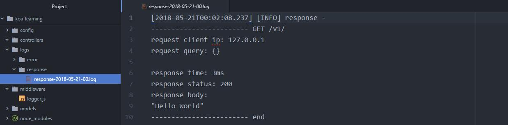


## MongoDB-数据库

### 安装MongoDB

下载MongoDB安装文件：mongodb-win32-x86_64-2008plus-ssl-3.4.5-signed.msi，双击执行安装。安装完成之后可以在安装目录找到，我的安装目录“C:\Program Files\MongoDB\Server\3.4\bin”，为了方便在命令行执行 `mongod` 、`mongo` , 将这个路径添加到系统环境变量。接下来可以在命令行执行：

```shell
mongod
```


证明我们的环境变量添加成功，在系统磁盘新建数据库存放目录，以本机为例：G:\MongoDB，G:\MongoDB\db  ，G:\MongoDB\log，以管理员身份在命令行执行：

```shell
mongod --bind_ip 127.0.0.1 --logpath "G:\MongoDB\log\mongod.log" --logappend --dbpath "G:\MongoDB\db" --port 3001 --serviceName "koa-learning" --serviceDisplayName "koa-learning" --install
```

> 以上命令的描述 补充

或者，我们新建一个 G:\MongoDB\mongod.cfg 文件，内容为：

```
systemLog:
 destination: file
 path: "G:\\MongoDB\\log\\mongod.log"
 logAppend: true
net:
 bindIp: 127.0.0.1
 port: 3001
storage:
 dbPath: "G:\\MongoDB\\db"
```
接下来执行：
```shell
mongod --config "G:\MongoDB\mongod.cfg" --serviceName "koa-learning" --serviceDisplayName "koa-learning" --install
```

这样我们就对数据库进行了设置，并且安装到了Windows的service，如果发生如下[问题](https://stackoverflow.com/questions/37352869/why-am-i-getting-a-parser-error-on-my-yaml-config-in-mongodb-install)：

```shell
Error parsing YAML config file: YAML-cpp: error at line 2, column 13 : illegal map value
```

使用空格代替tab，在“:”之后也使用一个空格

> YAML doesn't really satisfy with tabs, then, use space instead before destination and storage. Don't forget to add a space after every ":" even in the lines systemLog and storage Finally, use quotes to enclose your pathes and double backslashes in these pathes.

执行成功之后，我们可以看到log目录下面生成了一个log文件


打开这个log文件看到如下内容

```shell
2018-05-15T09:30:29.578-0700 I CONTROL  [main] Trying to install Windows service 'koa-learning'
2018-05-15T09:30:29.580-0700 I CONTROL  [main] Service 'koa-learning' (koa-learning) installed with command line '"C:\Program Files\MongoDB\Server\3.4\bin\mongod.exe" --bind_ip 127.0.0.1 --logpath G:\MongoDB\log\mongod.log --logappend --dbpath G:\MongoDB\db --port 3001 --service'
2018-05-15T09:30:29.580-0700 I CONTROL  [main] Service can be started from the command line with 'net start koa-learning'
```

然后以管理员身份执行：

```shell
net start koa-learning
```

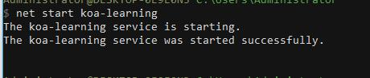

出现如图的结果，表示数据库已经启动，我们看到 G:\MongoDB\db 目录下多了一些文件，这些文件就是我们的数据库生成的。


将 net start koa-learning 添加到 package.json 中，以后执行 `npm run db` 即可启动服务器：

```json
……
  "scripts": {
    "start": "node app.js",
    "db": "net start koa-learning"
  },
……
```

执行以下命令即可连接到数据库：

```shell
mongo mongodb://127.0.0.1:3001
// 或者
mongo -port 3001
```


我们看到数据库是没有访问控制的，数据库的读写权限不受控制的。关于 MongoDB 访问权限的设置这里有 [`详细介绍`](https://docs.mongodb.com/master/tutorial/enable-authentication/) 。


### MongoDB的用户创建更新及删除

从上面的提示结果看到我们的数据库是没有访问控制的，因此这里我们来创建权限和用户。

> Enabling access control on a MongoDB deployment enforces authentication, requiring users to identify themselves. When accessing a MongoDB deployment that has access control enabled, users can only perform actions as determined by their roles.

> 关于 admin 数据库 补充

要使用访问控制，我们先确保有一个超级用户，这个用户在`admin` 数据库且拥有 [`userAdmin`](https://docs.mongodb.com/master/reference/built-in-roles/#userAdmin) 或者[`userAdminAnyDatabase`](https://docs.mongodb.com/master/reference/built-in-roles/#userAdminAnyDatabase) 的权限，超级用户可以创建用户、授权或者删除用户权限、自定义的权限。

我们可以在启动授权控制之前就创建超级用户，因为MongoDB提供了一个 [localhost exception](https://docs.mongodb.com/master/core/security-users/#localhost-exception)  来创建超级用户搭到 `admin` 数据库，一旦被创建了，我们需要验证登录这个用户来创建更多用户。


前面我们已经通过非授权的方式启动并且已经连接到数据库, 接下来就是创建超级用户:

```shell
> use admin
switched to db admin
```

> 命令的描述 补充

```shell
> db.createUser(
...   {
...     user: "admin",
...     pwd: "admin",
...     roles: [ { role: "userAdminAnyDatabase", db: "admin" } ]
...   }
... )
Successfully added user: {
        "user" : "admin",
        "roles" : [
                {
                        "role" : "userAdminAnyDatabase",
                        "db" : "admin"
                }
        ]
}
```

> 命令的描述 补充

超级用户可以访问所有数据库，这个用户是被创建在 admin 管理数据库，db 指定数据库。

我们删掉之前安装的 Windows service , 以管理员身份执行 `sc delete koa-learning` ：

```shell
$ sc delete koa-learning
[SC] DeleteService SUCCESS
```

接着启用权限控制，执行下面的命令，执行之前确保系统MongoDB进程关闭，这里使用的 `--auth` 是用来开启授权启动：

```shell
mongod --config "G:\MongoDB\mongod.cfg" --serviceName "koa-learning" --serviceDisplayName "koa-learning" --auth --install
```

```shell
net start koa-learning
```


我们先连接数据库：

```shell
mongo -port 3001
```

执行 `use healthyDiet` 使用 `healthyDiet`  数据库。我们可以执行 `db` 查看当前的数据库。先来插入一条数据试试：

```shell
> db.healthyDiet.insert({name:'Yuu'})
```


我们看到“not authorized on healthyDiet to execute command” ，这就是说, 我们没有权限操作。

因此我们切换到admin数据库去登录账号：

```shell
> use admin
switched to db admin
> db
admin
> db.auth("admin", "admin")
1 // 返回1 授权成功, 否则返回0, 并提示失败
```

使用 [`db.createUser()`](https://docs.mongodb.com/master/reference/method/db.createUser/#db.createUser) 添加用户，以及用户的 [内置权限](https://docs.mongodb.com/master/core/security-built-in-roles/) 或 [用户定义权限](https://docs.mongodb.com/master/core/security-user-defined-roles/) 。

我们上面创建的 `admin` 用户只能 [管理用户和权限](https://docs.mongodb.com/master/tutorial/manage-users-and-roles/)，如果要执行其它操作，如从数据库中查询数据，MongoDB 会返回错误。

下面我们来为 `healthyDiet ` 创建一个有 [读写权限](https://docs.mongodb.com/master/reference/built-in-roles/#readWrite) 的用户：

```shell
// 执行
> use healthyDiet
// 结果
switched to db healthyDiet


// 执行
> db.createUser(
...   {
...     user: "Yuu",
...     pwd: "123456",
...     roles: [ { role: "readWrite", db: "healthyDiet" } ]
...   }
... )
// 结果
Successfully added user: {
        "user" : "Yuu",
        "roles" : [
                {
                        "role" : "readWrite",
                        "db" : "healthyDiet"
                }
        ]
}
```

上面的示例中，我们切换到 healthyDiet 上创建用户， 因为只有在这里创建的用户才是这个数据库的用户， 才能在这里完成授权，但是创建用户的信息存放在 admin 库中。接着换到 admin 库，看一下我们创建的用户：

```js
> db.system.users.find({user:'Yuu'})
{ "_id" : "healthyDiet.Yuu", "user" : "Yuu", "db" : "healthyDiet", "credentials" : { "SCRAM-SHA-1" : { "iterationCount" : 10000, "salt" : "sd/AMDmlYvPnYjWWdabk6A==", "storedKey" : "zBQcQxRNSp8E3h0SdPcMrfFhDAE=", "serverKey" : "WaFuxva6hsmn1NkMBFjFltO9hWk=" } }, "roles" : [ { "role" : "readWrite", "db" : "healthyDiet" } ] }
```


然后我们现在用新增的用户来连接数据库，下面的命令是在连接数据库时就进行验证，和上面的先连接数据库再验证是一样的：

```shell
mongo --port 3001 -u Yuu -p 123456 --authenticationDatabase healthyDiet
```

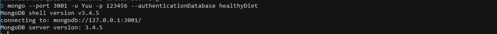

既然已经验证成功，我们就可以尝试着来写入数据了。

```shell
> use healthyDiet
switched to db healthyDiet
> db.healthyDiet.insert({name:'Yuu'})
WriteResult({ "nInserted" : 1 })
```

OK！


### 参数说明

| 参数                 | 描述                                                         |
| -------------------- | ------------------------------------------------------------ |
| --bind_ip            | 绑定服务IP，若绑定127.0.0.1，则只能本机访问，不指定默认本地所有IP |
| --logpath            | 定MongoDB日志文件，注意是指定文件不是目录                    |
| --logappend          | 使用追加的方式写日志                                         |
| --dbpath             | 指定数据库路径                                               |
| --port               | 指定服务端口号，默认端口27017                                |
| --serviceName        | 指定服务名称                                                 |
| --serviceDisplayName | 指定服务名称，有多个mongodb服务时执行。                      |
| --install            | 指定作为一个Windows服务安装。                                |


### 权限说明

| 分类                                       | role(角色)                                                   | 简要说明                                                     |
| ------------------------------------------ | ------------------------------------------------------------ | ------------------------------------------------------------ |
| 数据库用户角色(DB User Roles)              | `read` `readWrite`                                           | 为某个数据库创建一个用户, 分配该数据库的读写权力             |
| 数据库管理员角色(DB Admin Roles)           | `dbAdmin` `dbOwner` `userAdmin`                              | 拥有创建数据库, 和创建用户的权力                             |
| 集群管理角色(Culster Administration Roles) | `clusterAdmin` `clusterManager` `clusterMonitor` `hostManager` | 管理员组, 针对整个系统进行管理                               |
| 备份还原角色(Backup and Restoration Roles) | `backup` `restore`                                           | 备份数据库, 还原数据库                                       |
| 所有数据库角色(All-Database Roles)         | `readAnyDatabase` `readWriteAnyDatabase``userAdminAnyDatabase``dbAdminAnyDatabase` | 拥有对admin操作的权限                                        |
| Superuser Roles(超级管理员)                | `root`                                                       | `dbOwner` `userAdmin` `userAdminAnyDatabase`这几个角色角色提供了任何数据任何用户的任何权限的能力，拥有这个角色的用户可以在任何数据库上定义它们自己的权限 |

### 修改用户角色

更新用户

```shell
>db.updateUser([用户名],{用户对象, 与创建时一样})  //其实后面还有一个可选参数writeConcern, 一般不写
```

 创建用户时和更新用户都需要属性`user` `pwd` `roles`成功修改后没有任何提示. 如下:

```shell
//修改密码并且修改角色为只读
> db.updateUser('test',{user:'test',pwd:'admin',roles:[{role:'read',db:'testDB'}]})
>

```

以上需要注意的就是, `roles`数组里的对象数据`role` `db`两个都需要给出, 否则会出现错误


删除用户

```shell
> use testDB
switched to db testDB
> db.dropUser('test')
true
>
```

### 总结

- 一定切换到对应的数据库去创建用户， 否则在进行认证的时候, 会提示找不到用户。
- 一定要到对应的数据库上去认证用户，否则会认证授权失败。
- 不是所有人都能操作admin数据库， 分配给用户权限的时候，一定要谨慎。
- 修改用户和删除用户都和创建用户一样，需要切换到数据库管理员的身份。也就是需要先切换到`admin`库完成认证才能进行后面的操作，同样需要到对应数据库去操作用户， 因为用户是跟着库走的。


### 可视化

我们也可以下载 [Robomongo](https://robomongo.org/)  来进行可视化的操作，下载安装这里不做描述。

打开Robo之后，新增一个连接，


输入连接名称，地址和端口，

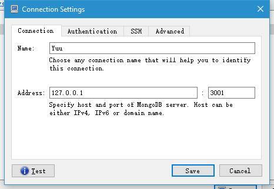

并且切换到用户验证栏输入验证信息，点击保存，

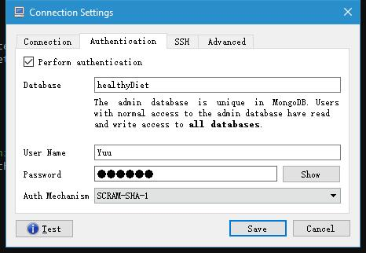

然后连接，我们就可以看到healthyDiet数据库了。

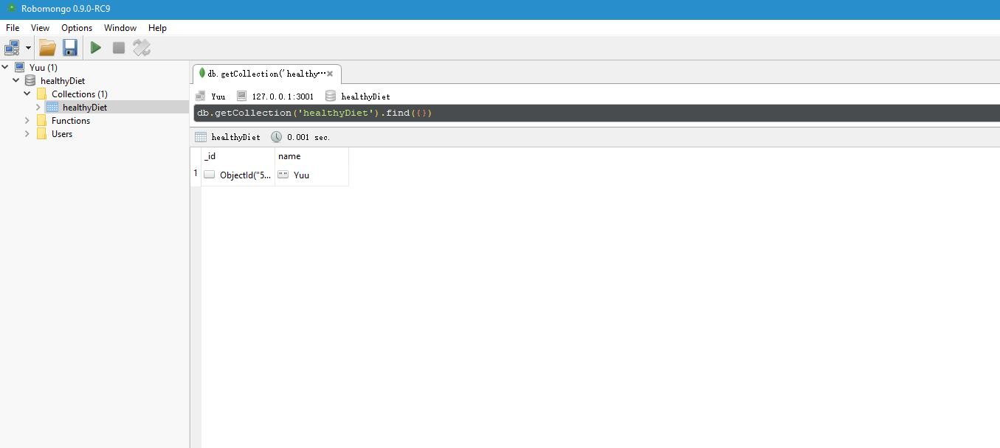


参考资料：

https://docs.mongodb.com/master/tutorial/enable-authentication/


## Config-项目设置


在项目开发中，我们希望有多个环境配置，如开发环境、生产环境、测试环境等。不同的环境可能需要不同的配置，如数据库、日志甚至端口等。此外，不同的开发者也有不同的设置。我们将使用一下两个包来解决这个问题。

- [config ](https://www.npmjs.com/package/config)  - 用来管理不同的运行环境
- [dotenv-safe](https://www.npmjs.com/package/dotenv-safe) - 用来定义一些需要保密的环境变量。

首先，我们来安装这两个包：

```shell
npm i config dotenv-safe
```

`config` 会默认去查看项目根目录的 config 文件夹，所以我们需要创建一个 config  目录，这个在之前已经做了。

然后来创建一个默认的配置文件 default.json ，其中包含了我们的数据库设置。以本项目为例，配置如下:

config/default.json

```js
{
  "App": {
    "apiVersion": "/v1",
    "server": "0.0.0.0", // 所有ip可以访问
    "port": 3000 // 端口
  },
  "Database": {
    "user": "Yuu", // MongoDB用户名
    "password": "123456", // MongoDB密码
    "host": "127.0.0.1",
    "dbName": "healthyDiet", // MongoDB数据库名
    "port": 3001
  }
}
```

在上面的代码中，我们配置了应用的设置 `App` 以及数据库连接配置 `Database` 然后，在项目的任何地方需要使用这些配置时，我们只需要引用 config 就可以了:

app.js

```js
const Koa = require('koa');
const app = new Koa();
const appConfig = config.get('App');
console.log(appConfig);

// 省略

app.listen(appConfig.port, appConfig.ip, () => {
  console.log('Server running');
});

```

启动服务之后，我们就能看到命令行能够打印出config.json里面的App配置信息。

```shell
{ apiVersion: '/v1', server: '0.0.0.0', port: 3000 }
Server running
```

### 配置多个环境

上面的介绍，我们已经通过config来配置运行环境了，但是仅仅是这样，我们并不能实现多个环境的配置，因此，现在我们需要来一个新的环境。

配置一个生产环境 *production*  ，为了配置生产环境，我们需要在 config   目录新建一个 production.json

config/production.json

```js
{
  "App": {
    "port": 8000
  }
}
```

我们并没有配置所有的变量，我们希望一些变量保持和默认配置一样，如服务启动的地址、服务器名称等等，

为了验证配置是否生效，我们来切换到production环境：

```shell
'export NODE_ENV=production'  // Linux
'set NODE_ENV=production'. // Windows

```

接下来我们启动服务就能够看到输出的环境配置已经改变，端口变成了8000。我们来访问 http://localhost:8000/v1 ，浏览器显示了 “Hello World” 。

```shell
Administrator@DESKTOP-0E9E0N3 G:\koa-learning
> set NODE_ENV=production

Administrator@DESKTOP-0E9E0N3 G:\koa-learning
> npm start

> koa-learning@1.0.0 start G:\koa-learning
> node app.js

{ apiVersion: '/v1', server: '0.0.0.0', port: 8000 }
Server running
```

事实上，当我们调用 `config.get('App') ` 时，会从对应环境的json文件去取值替换 default.json 对应的值。需要支持更多的运行环境，我们只需要新增其它的文件就行，如 staging.json 、 qa.json  等。


### 配置环境变量

上面的配置中，我们的数据库密码是卸载 config 里面的，我们不希望如此，为了安全起见，我们希望把密码配置在本地而不是提交到代码库或者仓库。因此，我们需要用到 dotenv-safe 。


dotenv-safe  让我们可以定义私有的变量，这是node进程运行的变量而不是上面配置的环境变量。dotenv-safe 默认会从项目根目录的 *.env* 文件中加载配置。我们新建一个  .env  文件：

 .env 

```js
DB_PASSWORD=123456
```

我们把数据库密码拿了出来，并且我们会在 *.gitignore*  忽略掉这个文件，这样就不会提交了，接下来我们新建一个

.env.example 文件用来提交到代码库，这个文件会没有对变量进行复制，但是能够表明项目使用的配置。并且，如果这个文件里面定义了 .env  没有的值，程序将停止执行。

.env.example

```js
DB_PASSWORD=
```

然后我们在app.js里面优先引入：

```js
require('dotenv-safe').load(); // 只需要引入一次
const Koa = require('koa');
const app = new Koa();
const appConfig = config.get('App');
console.log(process.env.DB_PASSWORD); // 123456
console.log(appConfig);

// 省略

app.listen(appConfig.port, appConfig.ip, () => {
  console.log('Server running');
});

```

启动服务查看：

```
> npm start

> koa-learning@1.0.0 start G:\koa-learning
> node app.js

123456
{ apiVersion: '/v1', server: '0.0.0.0', port: 8000 }
Server running
```

### 使用环境变量

接下来，我们将使用定义好的变量来替换 config 里面的配置。我们在 config 目录新增一个文件 custom-environment-variables.json

```js
{
  "Database": {
    "password": "DB_PASSWORD"
  }
}
```

这个 json 文件里面我们队数据库的密码进行了定义，当我们执行调用 `config.get('Database.password')`, `config` 将去查询一个叫 “DB_PASSWORD” 的环境变量。如果查询不到就会使用匹配当前环境的 json 文件的只来带起，如果当前环境的值任然没有，就会去查询 default.json 。

我们再看修改app.js 验证是否有效：

```js
require('dotenv-safe').load(); // 只需要引入一次
const Koa = require('koa');
const app = new Koa();
const appConfig = config.get('App');
const dbConfig = config.get('Database');
console.log(dbConfig);
console.log(appConfig);

// 省略

app.listen(appConfig.port, appConfig.ip, () => {
  console.log('Server running');
});
```

我们修改 .env 里面的值来启动服务查看是否生效

```
DB_PASSWORD=12345678
```

结果：

```shell
Administrator@DESKTOP-0E9E0N3 G:\koa-learning
> npm start

> koa-learning@1.0.0 start G:\koa-learning
> node app.js

{ user: 'Yuu',
  password: '12345678',
  host: '127.0.0.1',
  dbName: 'healthyDiet',
  port: 3001 }
{ apiVersion: '/v1', server: '0.0.0.0', port: 8000 }
Server running
```

### 修改之前的代码

路由前缀

```js

const config = require('config');
const apiVersion = config.get('App.apiVersion');

// 省略
const Router = require('koa-router');
const router = new Router();
router.prefix(apiVersion); // 设置路由前缀
// 省略

module.exports = router;

```

移除 app.js 中引入的旧的config

移除config里面的密码设置


参考资料：[Maintain Multiple Environment Configurations and Secrets in Node.js Apps](https://blog.stvmlbrn.com/2018/01/13/maintain-multiple-configurations-and-secrets-in-node-apps.html)


## mongoose-管理数据库

[mongoose文档](http://www.nodeclass.com/api/mongoose.html)

### 安装

```shell
npm install mongoose
```

### 连接MongoDB

首先在 ` config` 目录新增一个 `dbConfig.js` ：

`config\dbConfig.js`

```js
let mongoose = require('mongoose');
const config = require('config');
const dbConfig = config.get('Database');

exports.connect = (request, response) => {
  mongoose.connect(`mongodb://${dbConfig.user}:${dbConfig.password}@${dbConfig.host}:${dbConfig.port}/${dbConfig.dbName}?authSource=${dbConfig.dbName}`);
  let db = mongoose.connection;
  db.on('error', () => {
    console.log('Mongoose连接错误: ' + err);
  });
  db.once('open', callback => {
    console.log(`Mongoose连接到${dbConfig.dbName}`);
  });
}
```

然后在 /index.js 引入 config/dbConfig.js：

```js
const db = require('./config/dbConfig');
db.connect();
```

我们启动服务 `npm start` 即可看到数据库连接成功。

### model

在 mongoose 中，所有的东西都从 [Schema](http://www.nodeclass.com/api/mongoose.html#guide) 中衍生出来，先新建一个文件夹叫  models ，并在这个文件夹下新建一个 index.js ，再在该目录下新建 material.js

> 目的 描述

models/material.js

```js
const mongoose = require('mongoose');
const Schema = mongoose.Schema;

let materialModel = mongoose.model('Material', new Schema({
  code: String, // 食材编号
  purchasingDate: Date, // 采购日期
  name: String, // 名称
  manufactureDate: Date, //生成日期
  qualityPeriod: Date, // 保质期
  quantity: Number, // 数量
  unit: String, // 单位
  price: Number, // 单价
  totalPrice: Number, // 金额
  purchaserName: String, // 采购人
  inspectorName: String, // 收验货人
  supplierName: String, // 供货人
  sign: String, // 签字
}));

class Material {
  constructor() {
    this.material = materialModel;
    this.create = this.create.bind(this);
  }
  create(dataArr) {
    return new Promise((resolve, reject) => {
      let material = new this.material(dataArr);
      material.save((err, data) => {

        if (err) {
          console.log(err)
          reject(err);
          return
        }
        console.log('添加成功');
        resolve(data)
      });
    })
  }
}

const material = new Material()

module.exports = material;

```

以上的代码创建了一个叫 Material 的 model。

models/index.js

```js
const material = require('./material');

module.exports = {
  material
};
```

> 描述

新增数据：

routes/material.js

```js
const {material} = require('../models');
const router = require('koa-router')();

router.get('/', async (ctx, next) => {

  try {
    ctx.response.body = await material.create({
      code: 'ZB-M-00001', // 食材编号
      purchasingDate: new Date(), // 采购日期
      name: '土豆', // 名称
      manufactureDate: new Date(), //生成日期
      qualityPeriod: new Date(), // 保质期
      quantity: 1, // 数量
      unit: '个', // 单位
      price: 10, // 单价
      totalPrice: 10, // 金额
      purchaserName: 'Yuu', // 采购人
      inspectorName: 'Yuu', // 收验货人
      supplierName: 'Z', // 供货人
      sign: '123456789.png', // 签字
    });
  } catch (err) {
    console.log(err)
    throw new Error(err);
  }
});

module.exports = router;

```

我们修改 routes/index.js 的路由设置。

```js
……
const users = require('./users');
const material = require('./material');
const routeConfig = [
  {
    path: '/users',
    route: users
  }, {
    path: '/material',
    route: material
  }
]

……

router.use(logger);
router.get('/', index);

for (item in routeConfig) {
  router.use(routeConfig[item].path, routeConfig[item].route.routes(), routeConfig[item].route.allowedMethods());
}

module.exports = router;
```

重启服务访问 http://localhost:3000/v1/material 即可看到新增的数据了，并且数据库添加了新的数据。


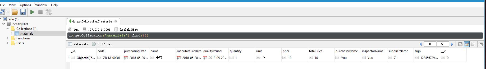


## RESTful API

### 响应

> 目的 描述

在 utils 目录新建 response.js ，在 config 目录新建 errorCode.json。

utils/response.js

```js
const errorCode = require('./errorCode');
// 对响应数据进行规范，如果传递的对象有errorCode，返回报错信息
module.exports = (response) => {
  const {errorCode, data, msg} = response;
  if (errorCode) {
    return {
      "error": true,
      "msg": msg
        ? msg
        : errorCode[response.errorCode],
      "data": {},
      "errorCode": errorCode
    }
  }
  if (data) {
    return {
      "error": false,
      "msg": msg
        ? msg
        : "",
      "data": data,
      "errorCode": ""
    }
  }
};

```

config/errorCode.json

```js
{
    "000":"系统错误，请联系管理员。",
    "001":"请先登录账户登录。",
    "002":"该邮箱已经注册过，请更换邮箱。",
    "003":"用户登录验证失败，请尝试重新登录。",
    // 省略
}
```

### 注册接口

为了实现用户注册，我们需要新增一个用户 model ，在 models 目录下新增一个 user.js ，并且在 model 的index.js 引入。

models/user.js

```js
const mongoose = require('mongoose');
const Schema = mongoose.Schema;

// 创建一个User model，包含用户新增的字段定义
let userModel = mongoose.model('User', new Schema({
  userNo: String,
  email: String,
  password: String,
  name: String,
  sex: Number,
  userType: String,
  avatar: String,
  createDate: Date
}));

// 新增一个用户class
class User {
  constructor() {
    this.users = userModel;
    this.find = this.find.bind(this); // 绑定上下文
    this.create = this.create.bind(this);
  }

  // 查询用户
  find(dataArr = {}) {
    return new Promise((resolve, reject) => {

      // 上面绑定了上下文，这里使用this.users
      this.users.find(dataArr, (err, docs) => { // 查询
        if (err) {
          console.log(err);
          reject(err);
        } else {
          resolve(docs);
        }
      })
    })
  }

  // 创建用户
  create(dataArr) {
    return new Promise((resolve, reject) => {
      let users = new this.users(dataArr);
      users.save((err, data) => {
        if (err) {
          console.log(err)
          reject(err);
          return
        }
        console.log('创建用户成功');
        resolve(data)
      });
    })
  }
}
const user = new User()

module.exports = user;

```

然后在models/index.js 引入user model

```js
const material = require('./material');
const user = require('./user');

module.exports = {
  material,
  user
};
```

为了便于逻辑控制，我们将注册用户的操作放到单独的文件中进行，新增目录 controllers ，并在其中新增 index.js 文件和 user.js 文件。

controllers/user.js

```js
……
const response = require('../utils/response');

class UserController {
  constructor() {}
  // 定义一个一部函数register用来注册用户，接收请求传过来的body
  async register(reqBody) {
    let dataArr = { // 展开运算，并添加创建时间
      ...reqBody,
      createDate: new Date()
    }
    try {
      let list = await user.find({email: dataArr.email}); // 先查询是否存在该用户
      let respon = {};
      if (list && list.length > 0) {
        respon = response({errorCode: '002'});
      } else {
        let newUser = await user.create(dataArr); // 如果没有注册过就进行注册
        respon = response({data: newUser});
      }
      return respon;
    } catch (err) {
      console.log(err)
      throw new Error(err);
      return err;
    }
  }
}

const userController = new UserController();

module.exports = userController;
```

我们也新建一个 controllers/index.js 来引入要用的 controller：

```js
const user = require('./user');

module.exports = {
  user
};

```

接下来需要在路由定义一个请求接口了，我们将之前的 routes\users.js 进行以下修改：

```js
const router = require('koa-router')();
const {user} = require('../controllers');

router.get('/', (ctx, next) => {
  ctx.response.body = 'users';
});

// 新增一个post路由，用来接收post请求
router.post('/register', async (ctx, next) => {
  // 接收客户端请求传递的数据
  let reqBody = ctx.request.body;
  console.log(ctx.request.body);
  ctx.body = await user.register(reqBody);
});

module.exports = router;

```

这样就定义了一个 RESTful API 了，为了验证能够调用成功，我们使用 postman 来进行调试。

### postman-调用接口

安装postman，打开并进行注册，这里不进行描述。打开postman，新增配置一个接口调用，如下图：

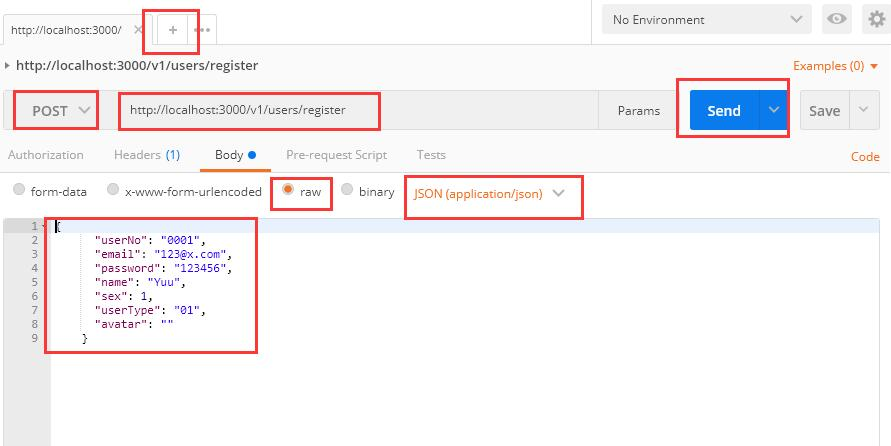

点击send，我们就可以发送一个post请求了，我们采用JSON格式传递数据。通过上面的操作我们看到 postman 里面产生响应数据，但是并没有我没新建的用户信息，我们再查看数据库集合里面多了一个文档，但是缺少了用户信息。

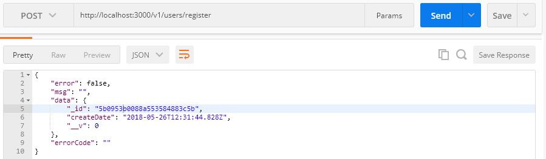


> 描述 补充

造成这个结果的原因是我们采用 JSON 类型来传递请求数据，context 里面获取的请求 body 为 undefined。为了让 koa 能够支持 JSON 类型的 body 数据，我们 [koa-bodyparser](https://github.com/koajs/bodyparser) 来处理,，koa-bodyparser 支持 `json`, `form` and `text` 类型的 body 。

安装：

```shell
npm install koa-bodyparser
```

在 app.js 使用这个中间件：

```js
const Koa = require('koa');
const app = new Koa();

……
const bodyParser = require('koa-bodyparser');


……
app.use(logger());
app.use(bodyParser());
app.use(routes.routes()).use(routes.allowedMethods());
……
```

重启服务之后，我们再次点击发送。

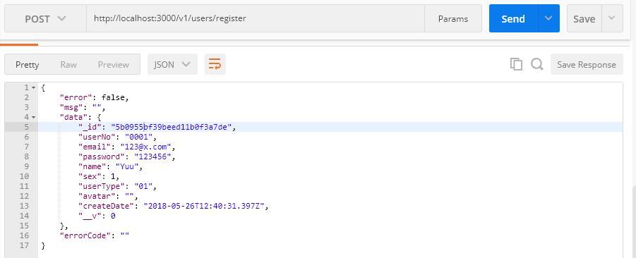

### 跨域访问

通过上面的实例，我们已经能够经过 postman 请求接口并存入数据了。为了验证接口是否能够在前端项目里面调用，我们将在前端页面中去请求这个接口。前端项目地址：待补充

在启动页面之后我们输入对应的数据，点击注册。我们发现浏览器的 console 里面报了一个错误。

Failed to load http://localhost:3000/v1/users/register: Response to preflight request doesn't pass access control check: No 'Access-Control-Allow-Origin' header is present on the requested resource. Origin 'http://localhost:8080' is therefore not allowed access.

这正是因为我们的接口没有允许跨域访问请求导致的。


> 描述 补充

为了解决这个问题，我们使用 [koa-cors](https://www.npmjs.com/package/koa-cors) 中间件来处理跨域请求。

```shell
npm install koa-cors
```

app.js

```js
……
const cors = require('koa-cors');

……
app.use(logger());
app.use(cors());
app.use(bodyParser());
……

```

重启服务之后我们再次点击注册。


成功，我们已经能在前端项目调用注册接口来注册用户了。


## JWT-token验证

JWT（JSON Web Tokens） 是一个方便的一种实现服务器与客服端安全通讯的一种规范。

### JWT

> 补充

### 安装和使用

 为了能够对用户登录进行验证，我们使用 JWT 来做校验，首先需要安装 [koa-jwt](https://github.com/koajs/jwt) 中间件。

```shell
npm install koa-jwt
```

在 .env 中添加 jwt 的加密混淆字符串，记得同时配置 .env.example ：

```json
DB_PASSWORD=123456
JWT_SECRET=healthy-diet
```

在config添加 JWT_SECRET  配置


config\custom-environment-variables.json

```json
{
  "Database": {
    "password": "DB_PASSWORD"
  },
  "Token": {
    "jwtSecret": "JWT_SECRET"
  }
}
```

注意：下面的设置保留了数据库密码和jwtSecret方便查看本项目，实际上需要移除

```js
{
  "App": {
    "apiVersion": "/v1",
    "server": "0.0.0.0",
    "port": 3000
  },
  "Database": {
    "user": "Yuu",
    "password": "123456",
    "host": "127.0.0.1",
    "dbName": "healthyDiet",
    "port": 3001
  },
  "Token": {
    "jwtSecret": "healthy-diet"
  }
}

```


我们接下来就在路由开始的地方使用 jwt 中间件。

routes/index.js：

```js
……
const response = require('../utils/response');
const jwt = require('koa-jwt');
const config = require('config');
const jwtSecret = config.get('Token.jwtSecret');

……
// 处理token验证出错，返回401
router.use( (ctx, next) => {
  return next().catch((err) => {
    if (401 == err.status) {
      ctx.status = 401;
      ctx.body = response({
        errorCode: '003'
      })
    } else {
      throw err;
    }
  });
});

// 只有token验证通过了之后才执行这一行以后的中间件
router.use(jwt({ secret: jwtSecret }));

for (item in routeConfig) {
  router.use(routeConfig[item].path, routeConfig[item].route.routes(), routeConfig[item].route.allowedMethods());
}

module.exports = router;
```

> 代码描述

启动服务之后，我们继续来访问注册接口，会得到以下提示：

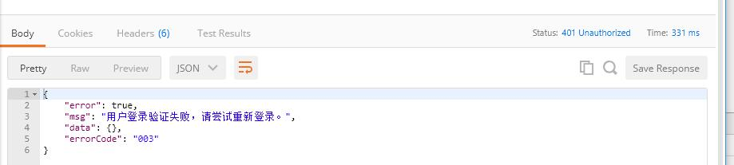

表示我们的注册接口已经收到了 jwt 的验证。

### 公用路由

为了使注册接口不需要 token 验证，我们单独配置一个公用的路由，在 routes 目录下新增一个public.js，

将用户注册的路由移到这里。

routes/public.js

```js
const router = require('koa-router')();
const {user} = require('../controllers');

// 新增一个post路由，用来接收post请求
router.post('/register', async (ctx, next) => {
  // the parsed body will store in ctx.request.body
  // if nothing was parsed, body will be an empty object {}

  // 接收客户端请求传递的数据
  let reqBody = ctx.request.body;
  console.log(ctx.request.body);
  ctx.body = await user.register(reqBody);
});

module.exports = router;

```

然后在 routes 目录的 index.js 引入刚才新建的 public 路由，并且对路由进行设置，添加到中间件。

```js
// 省略
const routeConfig = [
  {
    path: '/users',
    route: users
  }, {
    path: '/material',
    route: material
  }
]
const publicRouteConfig = [
  {
    path: '/public',
    route: public
  }
]
// 省略

for (item in publicRouteConfig) {
  router.use(publicRouteConfig[item].path, publicRouteConfig[item].route.routes(), publicRouteConfig[item].route.allowedMethods());
}
// 只有token验证通过了之后才执行这一行以后的中间件
router.use(jwt({ secret: jwtSecret }));

for (item in routeConfig) {
  router.use(routeConfig[item].path, routeConfig[item].route.routes(), routeConfig[item].route.allowedMethods());
}

module.exports = router;

```

启动服务，我们把前端的注册接口改为调用 http://localhost:3000/v1/public/register ，请求有响应，证明路由设置成功。

### 用户登录接口

既然 token 验证已经加入项目中，我们在调用接口时就需要验证用户登录的 token 信息，下面来添加用户登录接口，当用户登录之后，后台记录 token 信息，并且返回给前端 token。

首先，我们安装 jsonwebtoken 来实现 jwt：

```shell
npm install jsonwebtoken
```

接着为 user 的 model 增加一个查询单个用户的方法。

models/user.js

```js
……
// 查询单个用户
  findOne(dataArr) {
    return new Promise((resolve, reject) => {
      this.users.findOne(dataArr, (err, docs) => { // 查询
        if (err) {
          console.log(err);
          reject(err);
        } else {
          resolve(docs);
        }
      })
    })
  }
……
```

修改了 model 之后，我们在 controllers 中添加对应的注册逻辑

controllers\user.js

```js
……
const jwt = require('jsonwebtoken');
const config = require('config');
const jwtSecret = config.get('Token.jwtSecret');

class UserController {
  constructor() {}
  ……

  // 注册
  async signin(reqBody) {
    let dataArr = {
      ...reqBody
    }
    try {
      let result = await user.findOne(dataArr); // 查询该用户
      let respon = {};

      let userToken = {
        email: result.email
      }
      const token = jwt.sign(userToken, jwtSecret, {expiresIn: '3h'}) //token签名 有效期为3小时
      const res = {
        result: '登录成功！',
        token: token
      }
      respon = response({data: res});

      return respon;
    } catch (err) {
      console.log(err)
      throw new Error(err);
      return err;
    }
  }
}

const userController = new UserController();

module.exports = userController;

```

然后在上面提到的 routes/public.js 中添加登录接口。

```js
// 用户登录接口
router.post('/signin', async (ctx, next) => {
  let reqBody = ctx.request.body;
  ctx.body = await user.signin(reqBody);
});
```

启动服务，我们调用登录接口，这是就能看到返回的数据里面生成了token。


## 数据验证

在上面的实战中，我们已经完成了登录接口和注册接口，我们已经发现，如果调用登录接口或者注册接口时，不传参数或者传递错误的数据，我们的请求将不会成功，在 postman 中我们也可以看到显示 Not Found 。 这时我们需要为接口增加验证，虽然我们可以通过接受请求的body来对需要的参数进行判断，但是会显得非常繁杂，为了更加简便的对传参进行校验，我们使用 [koa2-validation](https://github.com/gedennis/koa2-validation) 来校验参数。

koa2-validation 是一个使用 Joi来校验请求的 koa 中间件。 支持 `body`, `params`, `query` 参数。

### 使用 koa2-validation

```shell
npm i koa2-validation
```

引入 koa2-validation，以用户注册登录为例，在 routes/public.js 中，

```js
const validate = require('koa2-validation'); // 引入 koa2-validation
const Joi = require('joi'); // 引入 joi
// 省略

// 定义用于验证的 schema
const register = {
  body: {
    email: Joi.string().required(),
    name: Joi.string().required(),
    password: Joi.number().required()
  }
};

const signin = {
  body: {
    email: Joi.string().required(),
    password: Joi.number().required()
  }
}

// 新增一个post路由，用来接收post请求
router.post('/register', validate(register), async (ctx, next) => { // 设置需要验证的中间件
  // 接收客户端请求传递的数据
  let reqBody = ctx.request.body;
  console.log(ctx.request.body);
  ctx.body = await user.register(reqBody);
});

// 用户登录接口
router.post('/signin', validate(signin), async (ctx, next) => {
  let reqBody = ctx.request.body;
  ctx.body = await user.signin(reqBody);
});

module.exports = router;

```

为了获取验证信息，我们将改造路由入口的错误处理中间件，routes/index.js

```js
// 省略

// 处理token验证出错，返回401,处理其它错误
router.use( (ctx, next) => {
  return next().catch((err) => {
    if (401 == err.status) {
      ctx.status = 401;
      ctx.body = response({
        errorCode: '003'
      })
    } else {
      ctx.status = err.status || err.code;
      ctx.body = response({
        errorCode: ctx.status,
        msg: err.message
      });
      throw err;
    }
  });
});

// 省略

module.exports = router;

```

接下来我们启动服务，用postman来请求参数，验证是否生效。


### 关于joi

https://github.com/hapijs/joi


> 待整理

Object schema description language and validator for JavaScript objects. 

#### Introduction

Imagine you run facebook and you want visitors to sign up on the website with real names and not something like `l337_p@nda` in the first name field. How would you define the limitations of what can be inputted and validate it against the set rules?

This is joi, joi allows you to create *blueprints* or *schemas* for JavaScript objects (an object that stores information) to ensure *validation* of key information.

#### API

See the detailed [API Reference](https://github.com/hapijs/joi/blob/v13.3.0/API.md).

#### Example

```
const Joi = require('joi');

const schema = Joi.object().keys({
    username: Joi.string().alphanum().min(3).max(30).required(),
    password: Joi.string().regex(/^[a-zA-Z0-9]{3,30}$/),
    access_token: [Joi.string(), Joi.number()],
    birthyear: Joi.number().integer().min(1900).max(2013),
    email: Joi.string().email()
}).with('username', 'birthyear').without('password', 'access_token');

// Return result.
const result = Joi.validate({ username: 'abc', birthyear: 1994 }, schema);
// result.error === null -> valid

// You can also pass a callback which will be called synchronously with the validation result.
Joi.validate({ username: 'abc', birthyear: 1994 }, schema, function (err, value) { });  // err === null -> valid
```

The above schema defines the following constraints:

- ```
  username
  ```

  - a required string
  - must contain only alphanumeric characters
  - at least 3 characters long but no more than 30
  - must be accompanied by `birthyear`

- ```
  password
  ```

  - an optional string
  - must satisfy the custom regex
  - cannot appear together with `access_token`

- ```
  access_token
  ```

  - an optional, unconstrained string or number

- ```
  birthyear
  ```

  - an integer between 1900 and 2013

- ```
  email
  ```

  - a valid email address string

#### Usage

Usage is a two steps process. First, a schema is constructed using the provided types and constraints:

```
const schema = {
    a: Joi.string()
};
```

Note that **joi** schema objects are immutable which means every additional rule added (e.g. `.min(5)`) will return a new schema object.

Then the value is validated against the schema:

```
const {error, value} = Joi.validate({ a: 'a string' }, schema);

// or

Joi.validate({ a: 'a string' }, schema, function (err, value) { });
```

If the input is valid, then the error will be `null`, otherwise it will be an Error object.

The schema can be a plain JavaScript object where every key is assigned a **joi** type, or it can be a **joi** type directly:

```
const schema = Joi.string().min(10);
```

If the schema is a **joi** type, the `schema.validate(value, callback)` can be called directly on the type. When passing a non-type schema object, the module converts it internally to an object() type equivalent to:

```
const schema = Joi.object().keys({
    a: Joi.string()
});
```

When validating a schema:

- Values (or keys in case of objects) are optional by default.

  ```
  Joi.validate(undefined, Joi.string()); // validates fine
  ```

  To disallow this behavior, you can either set the schema as `required()`, or set `presence` to `"required"` when passing `options`:

  ```
  Joi.validate(undefined, Joi.string().required());
  // or
  Joi.validate(undefined, Joi.string(), /* options */ { presence: "required" });
  ```

- Strings are utf-8 encoded by default.

- Rules are defined in an additive fashion and evaluated in order after whitelist and blacklist checks.


## 文件上传

> 待整理

# koa学习笔记——**application.js**

## 创建服务

```js
const Koa = require('koa');
const app = new Koa();
app.listen(3000);
```

在上面的例子中，使用 `app.listen(3000)`  来创建一个服务， `app.listen(…)` 实际上是`http.createServer(app.callback()).listen(…)`  方法的语法糖:

```js
  listen(...args) {
	debug('listen');
	const server = http.createServer(this.callback());
	return server.listen(...args);
  }
```

## 处理请求 - callback

`this.callback()` 首先是使用 `koa-compose` 将应用的中间件进行了合并，返回了一个方法 `handleRequest`  来处理node的http请求。在`handleRequest`  中不仅创建了 context 上下文，还调用了应用本身的 `handleRequest` 函数来处理请求。

```js
  callback() {
    const fn = compose(this.middleware); // 合并中间件

    if (!this.listenerCount('error')) this.on('error', this.onerror);

    const handleRequest = (req, res) => {
      const ctx = this.createContext(req, res); // 在这里创建了上下文
      return this.handleRequest(ctx, fn);
    };

    return handleRequest;
  }
```
下面是应用的 `handleRequest` 函数，它接收 `callback` 方法中传递的上下文 `ctx` 和中间件`fnMiddleware` ，然后把 `ctx` 作为`fnMiddleware`的参数传递。当中间件执行完毕之后，会调用应用的 `respond()` 接收 `ctx` ，然后对响应进行处理。
```js

  /**
   * Handle request in callback.
   *
   * @api private
   */

  handleRequest(ctx, fnMiddleware) {
    const res = ctx.res;
    res.statusCode = 404;
    const onerror = err => ctx.onerror(err);
    const handleResponse = () => respond(ctx);
    onFinished(res, onerror);
    return fnMiddleware(ctx).then(handleResponse).catch(onerror); // 将创建的上下文传递给中间件，最终返回响应
  }
```

## 上下文 - context

> 待补充


## 中间件-Middleware

### 使用 - app.use(function)

将给定的中间件方法添加到此应用程序。

```js
app.use(fn);
```

当我们执行` use()` 时，会先判断传递的中间件是否是一个函数，如果不是就报出错误，再判断中间件是否是旧版的生成器 `generator` ，如果是，就使用 `koa-convert ` 来转换成新的中间件，最后将中间件push到 `middleware` 数组里面。

```js
  /**
   * Use the given middleware `fn`.
   *
   * Old-style middleware will be converted.
   *
   * @param {Function} fn
   * @return {Application} self
   * @api public
   */

  use(fn) {
    if (typeof fn !== 'function') throw new TypeError('middleware must be a function!');
    if (isGeneratorFunction(fn)) {
      deprecate('Support for generators will be removed in v3. ' +
                'See the documentation for examples of how to convert old middleware ' +
                'https://github.com/koajs/koa/blob/master/docs/migration.md');
      fn = convert(fn);
    }
    debug('use %s', fn._name || fn.name || '-');
    this.middleware.push(fn);
    return this;
  }
```

从上面的源码我们可以看出，当我们在应用里面使用多个中间件时，`koa` 都会将它们放在自身的一个数组中。

### 中间件合并 - koa-compose

前面的介绍我们已经知道，在调用use方法时，我们会吧所有的中间件都放到应用的一个数组里面，最终在执行callback时被调用。而在callback中，中间件被 `koa-compose` 进行了压缩。我们来看  `koa-compose` 到底做了什么。

源码：

```js
'use strict'

/**
 * Expose compositor.
 */

module.exports = compose

/**
 * Compose `middleware` returning
 * a fully valid middleware comprised
 * of all those which are passed.
 *
 * @param {Array} middleware
 * @return {Function}
 * @api public
 */

function compose (middleware) {
  if (!Array.isArray(middleware)) throw new TypeError('Middleware stack must be an array!')
  for (const fn of middleware) {
    if (typeof fn !== 'function') throw new TypeError('Middleware must be composed of functions!')
  }

  /**
   * @param {Object} context
   * @return {Promise}
   * @api public
   */

  return function (context, next) {
    // last called middleware #
    let index = -1
    return dispatch(0)
    function dispatch (i) {
      if (i <= index) return Promise.reject(new Error('next() called multiple times'))
      index = i
      let fn = middleware[i]
      if (i === middleware.length) fn = next
      if (!fn) return Promise.resolve()
      try {
        return Promise.resolve(fn(context, dispatch.bind(null, i + 1)));
      } catch (err) {
        return Promise.reject(err)
      }
    }
  }
}
```

解析：首先compose会先检测我们的中间件是否是一个数组，然后再开始遍历，并且对每一项都做了判断，看是否是一个函数。

dispatch 会返回一个Promise， 一开始执行dispatch()时，传递参数0，那么就会执行第一个中间件：

```js
Promise.resolve(function(context, next){ // 这里的next指向了dispatch.bind(null, i + 1)，也就是dispatch(1)
    // 中间件1的代码
}());
```

加入中间件里面写了next():

```js
Promise.resolve(function(context, next){
    // 中间件1的代码
    next()
    // 中间件1的后半部分代码
}());


// 结果
Promise.resolve(function(context, 中间件2){
    // 中间件1的代码
    Promise.resolve(function(context, next){ // 这里的next同样是指向下一个中间件的
        // 中间件2的代码
    }())
    // 中间件一第二部分代码
}());
```

以此类推，如果需要执行第三个中间件，我们也需要在第二个中间件里面添加next()

```js
Promise.resolve(function(context, 中间件2){
	//中间件一第一部分代码
	Promise.resolve(function(context, 中间件3){
		//中间件二第一部分代码
		Promise(function(context){
			//中间件三代码
		}());
		//中间件二第二部分代码
	})
	//中间件一第二部分代码
}());
```

执行到最后一个中间件时，dispatch 会调用这个Promise的next()，接着代码会从中间件三开始，再执行中间件二的第二部分代码，执行完毕，开始执行中间一第二部分代码，执行完毕，所有中间件加载完成。

 可以看到，Koa2.x是从第一个中间件开始，遇到await/yield next，就中断本中间件的代码执行，跳转到对应的下一个中间件执行，一直到最后一个中间件，中间件代码执行完成之后又执行上一个中间件await/yield next之后的代码，直到全部执行结束。

最终在调用app.listen()时，`koa` 放在 `middleware`  数组里面的中间件将会被合并，在处理响应的时候被调用。

### 转换中间件

我们来对比一下旧的和新的中间件，旧的中间件是一个传统的 generator  ，我们都是通过调用它的 next 来执行中间件的 `next` ，新的中间件是一个 promise 。

```js
function * legacyMiddleware (next) {
  // before
  yield next
  // after
}

function modernMiddleware (ctx, next) {
  // before
  return next().then(() => {
    // after
  })
}
```

> 待补充

### 写法

koa2用采用了es6，7的新特性，因为后端的很多操作方法，比如文件，数据库，都是异步的，所以这种将异步写法变为同步写法，是代码的可读性大大提高。

以前采用callback：

```js
exports.getUserList = function() {
	user.find({
	 _id: id,
	}, arr, function(e, numberAffected, raw) {
	  if(e){
		  respondata={
		    "code":"000",
		    "message":"error"
		  };
	  }else{
		  respondata={
		    "code":"200",
		    "message":"success"
		  };
	  }
	});
}

```

现在可以用 async await：

```js
exports.getUserList = async (ctx, next) => {
    try {
        let list = await user.find();
        let respon = {
            code: '200',
            message: 'success',
            data: list
        }
        return respon;
    } catch (err) {
        let respon = {
            code: '000',
            message: 'error',
            data: err
        }
        return respon;
    }
}
```

### 总结

中间件类似于一个过滤器，在客户端和应用程序之间处理请求和响应。

```js
.middleware1 {
  // (1) do some stuff
  .middleware2 {
    // (2) do some other stuff
    .middleware3 {
      // (3) NO next yield !
      // this.body = 'hello world'
    }
    // (4) do some other stuff later
  }
  // (5) do some stuff lastest and return
}
```

中间件的执行很像一个洋葱，但并不是一层一层的执行，而是以next为分界，先执行本层中next以前的部分，当下一层中间件执行完后，再执行本层next以后的部分。


```js
let koa = require('koa');
let app = new koa();

app.use((ctx, next) => {
  console.log(1)
  next(); // next不写会报错
  console.log(5)
});

app.use((ctx, next) => {
  console.log(2)
  next();
  console.log(4)
});

app.use((ctx, next) => {
  console.log(3)
  ctx.body = 'Hello World';
});

app.listen(3000);
// 打印出1、2、3、4、5
```

上述简单的应用打印出1、2、3、4、5，这就是一个洋葱结构，从上往下一层一层进来，再从下往上一层一层回去，解决复杂应用中频繁的回调而设计的级联代码，并不直接把控制权完全交给下一个中间件，而是碰到next去下一个中间件，等下面都执行完了，还会执行next以下的内容。


## Response处理

在前面的介绍之后可以看到，在请求经过中间件的处理完成之后，就会调用 callback 函数里面的 `handleResponse ` 来处理响应，`handleResponse ` 调了应用本身的 `respond`


koa处理响应的实现：

```js
/**
 * Response helper.
 */

function respond(ctx) {
  // allow bypassing koa
  if (false === ctx.respond) return;

  const res = ctx.res;
  if (!ctx.writable) return;  // 判断是否是context是否是可写的。

  let body = ctx.body;
  const code = ctx.status;

  // ignore body
  if (statuses.empty[code]) { // 如果状态码是不需要返回body的类型，如果不希望返回body，statuses.empty 返回true
    // strip headers
    ctx.body = null;
    return res.end();
  }

  if ('HEAD' == ctx.method) {
    if (!res.headersSent && isJSON(body)) {
      ctx.length = Buffer.byteLength(JSON.stringify(body));
    }
    return res.end();
  }

  // status body
  if (null == body) {
    body = ctx.message || String(code);
    if (!res.headersSent) {
      ctx.type = 'text';
      ctx.length = Buffer.byteLength(body);
    }
    return res.end(body);
  }

  // responses
  if (Buffer.isBuffer(body)) return res.end(body);
  if ('string' == typeof body) return res.end(body);
  if (body instanceof Stream) return body.pipe(res);

  // body: json
  body = JSON.stringify(body);
  if (!res.headersSent) {
    ctx.length = Buffer.byteLength(body);
  }
  res.end(body);
}
```

> 待补充

# koa学习笔记——context.js

> 待更新

# koa学习笔记——request.js

> 待更新

# koa学习笔记——response.js

> 待更新
