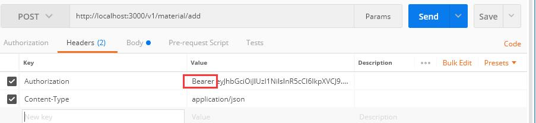
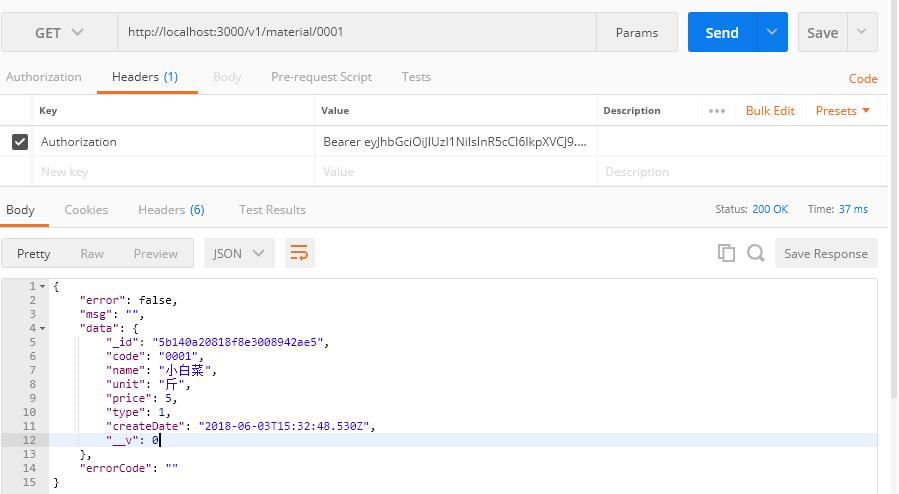

## 数据操作

### 新增和查询

在前面的介绍中，我们已经通过koa2-validation验证请求参数，现在讲开始进行数据插入和查询。下面的介绍将以 material 为例，我们将在 material 集合里面插入文档，并且通过请求查询文档。

为了实现新增和查询，我们先来改造 material model，和之前的user创建一样，我们增加查询和单个查询：

models/material.js

```js
const mongoose = require('mongoose');
const Schema = mongoose.Schema;

let materialModel = mongoose.model('Material', new Schema({
  code: String, // 食材编号
  name: String, // 名称
  unit: String, // 单位
  price: Number, // 单价
  type: Number, // 类型
  createDate: Date // 创建时间
}));

class Material {
  constructor() {
    this.material = materialModel;
    this.create = this.create.bind(this);
    this.find = this.find.bind(this);
    this.findOne = this.findOne.bind(this);
  }
  create(dataArr) {
    return new Promise((resolve, reject) => {
      let material = new this.material(dataArr);
      material.save((err, data) => {

        if (err) {
          console.log(err)
          reject(err);
          return
        }
        console.log('添加成功');
        resolve(data)
      });
    })
  }

  // 查询材料
  find(dataArr = {}) {
    return new Promise((resolve, reject) => {

      this.material.find(dataArr, (err, docs) => {
        if (err) {
          console.log(err);
          reject(err);
        } else {
          resolve(docs);
        }
      })
    })
  }

  // 查询一种材料
  findOne(reqParams) {
    return new Promise((resolve, reject) => {
      this.material.findOne(reqParams, (err, docs) => { // 查询
        if (err) {
          console.log(err);
          reject(err);
        } else {
          resolve(docs);
        }
      })
    })
  }
}

const material = new Material()

module.exports = material;

```

同样的，为了操作新增和查询，我们也需要一个controller，所以我们在 controllers 目录新建  material.js：

controllers/material.js

```js
let {material} = require('../models');
const response = require('../utils/response');

class MaterialController {
  constructor() {}
  // 接收请求传过来的body
  async addMaterial(reqBody) {
    let dataArr = { // 添加创建时间
      ...reqBody,
      createDate: new Date()
    }
    try {
      console.log("添加材料");
      let list = await material.find({name: dataArr.name});   // 先通过材料名验证材料是否存在
      let respon = {};
      if (list && list.length > 0) {
        respon = response({errorCode: '010'}); // 已经存在的材料提示错误
      } else {
        let newMaterial = await material.create(dataArr);
        respon = response({data: newMaterial});
      }
      return respon;
    } catch (err) {
      console.log(err)
      throw new Error(err);
      return err;
    }
  }

  // 获取材料
  async getMaterial(reqParams) {
    try {
      let respon = {};
      let result = await material.findOne(reqParams);
      respon = response({data: result});
      return respon;
    } catch (err) {
      console.log(err)
      throw new Error(err);
      return err;
    }

  }
}

const materialController = new MaterialController();

module.exports = materialController;

```

当然也不要忘记引入新增的controller，在 controllers/index.js 中引入：

```js
const user = require('./user');
const material = require('./material');

module.exports = {
  user, material
};
```

最后就是要在路由配置请求了，在 routes/material.js 中，我们将对添加材料和查询材料的接口进行定义，我们用GET请求来查询材料信息，并且对请求的参数 params 进行了校验：

```js
const validate = require('koa2-validation');
const Joi = require('joi');
const {material} = require('../controllers');
const router = require('koa-router')();

const addMaterial = {
  body: {
    code: Joi.string().required(), // 食材编号
    name: Joi.string().required(), // 名称
    unit: Joi.string(), // 单位
    price: Joi.number(), // 单价
    type: Joi.number(), // 类型
    createDate: Joi.date() // 创建时间
  }
}

const getMaterial = {
  params: { // 需要注意这里的校验改为了 params
    code: Joi.string().required(),
  }
}

router.post('/add', validate(addMaterial), async (ctx, next) => {
  let reqBody = ctx.request.body;
  ctx.body = await material.addMaterial(reqBody);
});

router.get('/:code', validate(getMaterial), async (ctx, next) => {
  let reqParams = ctx.params;
  ctx.body = await material.getMaterial(reqParams);
});

module.exports = router;

```

重新启动服务，在postman里面进行验证，这里提一下，由于我们的接口都需要token验证，因此需要先调用登录接口获得token，在postman中添加headers  `Authorization : Bearer token信息`  ，先来新增一个材料试试：

首先是设置headers验证



然后传入参数点击发送：


我们可以尝试重复发送请求，看是否会提示添加的材料重复，同样的，我们来看看查询是否有结果：



至此，我们已经能够通过请求来做新增和查询了。

### 使用继承

#### ES6中的CLASS继承

> 待补充

constructor

super

extends

通过上面的实战，我们发现，在新增用户查询用户，新增材料查询材料的时候，我们都会去新增model来做查询和创建数据，细心观察我们发现这些model做的工作实际是一样的，无非就是增删查改，为了减少重复，我们决定把model单独抽取出来作为一个类，然后通过继承这个类来实现增删查改。

二话不说，先在models目录新建一个model.js，把对数据做的操作写进来，根据前面的介绍，我们只做了查询和新增，下面先写到 model.js ，在接下来的实战中，我们还会增加更多的处理：

models/model.js

```js
const mongoose = require('mongoose');
// 新增一个Model class
class Model {
  constructor(name, schema) {
    // 保存之前更新时间戳
    schema.pre('save', function(next) {
      if (this.isNew) {
        this.createDate = this.updateDate = Date.now()
      }
      else {
        this.updateDate = Date.now()
      }
      next()
    })
    // 创建model
    this.model = mongoose.model(name, schema);
    this.find = this.find.bind(this); // 绑定上下文
    this.create = this.create.bind(this);
    this.findOne = this.findOne.bind(this);
  }

  // 查询
  find(dataArr = {}) {
    return new Promise((resolve, reject) => {
      // 上面绑定了上下文，这里使用this.model
      this.model.find(dataArr, (err, docs) => {
        if (err) {
          console.log(err);
          reject(err);
        } else {
          resolve(docs);
        }
      })
    })
  }

  // 查询单个
  findOne(dataArr) {
    return new Promise((resolve, reject) => {
      this.model.findOne(dataArr, (err, docs) => {
        if (err) {
          console.log(err);
          reject(err);
        } else {
          resolve(docs);
        }
      })
    })
  }

  // 创建
  create(dataArr) {
    return new Promise((resolve, reject) => {
      let model = new this.model(dataArr);
      model.save((err, data) => {
        if (err) {
          console.log(err)
          reject(err);
          return
        }
        console.log('创建成功');
        resolve(data)
      });
    })
  }
}

module.exports = Model;

```

接下来的事情就变得更简单了，我们来改造原来的models/material.js 和 models/user.js ：

models/material.js

```js
const mongoose = require('mongoose');
const Schema = mongoose.Schema;
const Model = require('./model');

const materialSchema = new Schema({
  code: Number, // 食材编号
  name: String, // 名称
  unit: String, // 单位
  price: Number, // 单价
  type: Number, // 类型
  createDate: Date, // 创建时间
  updateDate: Date // 修改时间
});

class Material extends Model {
  constructor() {
    super('Material', materialSchema); // 调用父级class的构造函数，并且把自己的schema传递过去
  }
}

const material = new Material();

module.exports = material;

```

models/user.js

```js
const mongoose = require('mongoose');
const Schema = mongoose.Schema;
const Model = require('./model');

// 创建一个User schema，包含用户新增的字段定义
let userSchema = new Schema({
  userNo: String,
  email: String,
  password: String,
  name: String,
  sex: Number,
  userType: String,
  avatar: String,
  createDate: Date,
  updateDate: Date
});

class User extends Model {
  constructor() {
    super('User', userSchema);
  }
}
const user = new User();

module.exports = user;

```

重新启动服务，我们就可以再次调用接口验证了。

### 自增代码

关于前面写好的材料新增接口，由于前端调用时需要传递code，code表示材料的代码，并且接口只判断了材料名是否重复，并没有判断code，因此，我们打算做一个自增的code，由后台管理，并且前端并不需要传递code。

MongoDB默认使用12-byte ObjectId  的 _id 字段来作为文档的唯一标识，然而有时候我们需要修改这个字段，或者修改别的字段，使它的值能够自增，因此我们需要新增一个MongoDB文档推荐的 counters 集合，以本实战为例，我们接下来为 material 新增的文档的code字段做自增。

首先，这个集合包含两个字段 `_id` 和 `sequenceValue` , sequenceValue 就是用来记录最新的数值，而 _id 将用来标识当前的值是属于哪一种类型的自增。

我们在 models 目录新建一个 counters.js，然后创建需要的 model ，在这个 model 中，我们定义了能够用来自增的方法 `findByIdAndUpdate` 并且对 sequenceValue 的值进行了加1，需要注意的是，如果一开始没有这个文档，我们需要 `{ new: true,  upsert: true}` 选项来创建默认的文档。

models/counters.js

```js
const mongoose = require('mongoose');
const Schema = mongoose.Schema;
const Model = require('./model');

let countersSchema = new Schema({
  "_id": {
    type: String,
    required: true
  },
  "sequenceValue": {
    type: Number,
    default: 1
  }
});

class Counters extends Model {
  constructor() {
    super('Counters', countersSchema);
    this.findByIdAndUpdate = this.findByIdAndUpdate.bind(this);
  }

  findByIdAndUpdate(id) {

    return new Promise((resolve, reject) => {
      // 如果有计数，则对序列值进行自增,如果没有则创建
      this.model.findByIdAndUpdate({
        _id: id
      }, {
        $inc: {
          sequenceValue: 1
        }
      }, {
        new: true,
        upsert: true
      }, (err, docs) => {
        if (err) {
          reject(err);
        } else {
          resolve(docs);
        }
      })
    })
  }
}

const counters = new Counters();

module.exports = counters;
```

准备好 counters 之后，我们就需要对之前的 models/material.js 进行修改，首先我们把材料的code设置为 Number 类型并且默认值为1，然后使用mongoose的pre钩子在储存之前对model进行操作。我们可以通过下面的代码看到，在更新counters成功之后，我们会设置 material 的 code ，并且调用了钩子的 next 进入下一个处理。

```js
const mongoose = require('mongoose');
const Schema = mongoose.Schema;
const Model = require('./model');
const Counters = require('./Counters');

const materialSchema = new Schema({
  code: {
    type: Number,
    default: 1
  }, // 食材编号

	// 省略
})

class Material extends Model {
  constructor() {
    materialSchema.pre('save', async function(next) {
      try {
        if(this.code == 1) { // 对于已有ID的数据不做自增
          let counter = await Counters.findByIdAndUpdate('materialId');
          this.code = counter.sequenceValue;
          next()
        }
      } catch (err) {
        console.log(err);
        return next(err);
      }
    });
    super('Material', materialSchema); // 调用父级class的构造，并且把自己的model传递过去
  }
}


// 省略

```

然后剩的就是处理controllers和 router了，我们在 controllers/material.js 里把添加材料接收参数去掉日期的创建，并且在 routes/material.js 里面去掉code必填的校验。

 controllers/material.js

```js

// 省略

class MaterialController {
  constructor() {}
  // 接收请求传过来的body
  async addMaterial(reqBody) {
    let dataArr = {
      ...reqBody
    }
// 省略

```

 routes/material.js

```js
// 省略
const addMaterial = {
  body: {
    // code: Joi.string().required(), // 把这里的校验去掉
    name: Joi.string().required(),
    unit: Joi.string(),
    price: Joi.number(),
    type: Joi.number(),
    // createDate: Joi.date() // 由于创建时间和更新时间已经放到pre钩子里面处理，这里取消调用时的传递，我们同时也可以移除其它model以及controller里面对创建时间的定义和设置。
  }
}
// 省略
```

然后我们启动服务，就可以调用接口进行测试了，新增材料可以不传递code，完全有后台自动增加code的值。


### 分页查询

前面已经完成了材料添加的接口，接下来将为材料列表的查询增加分页。首先还是为model增加查询列表的方法。

models/model.js

```js
  constructor(name, schema) {
    // 省略
    this.pageSize = 10; // 在这里增加了默认一页查询10条

    // 省略
  }

  // 查询
  find(dataArr = {}) {
    let pageSize,
      page;
    if (dataArr.pageSize || dataArr.page) { // 如果在查询过程中传递了分页pageSize或者前页page
      pageSize = dataArr.pageSize || this.pageSize; // 使用分页
      page = dataArr.page || 1;
      dataArr.pageSize = undefined;
      dataArr.page = undefined;
      return new Promise((resolve, reject) => {
        this.model.find(dataArr).limit(pageSize).skip(pageSize * (page - 1)).sort({createDate: -1}).lean().exec((err, docs) => {
          if (err) {
            console.log(err);
            reject(err);
          } else {
            resolve(docs);
          }
        });
      })
    }
    // 如果没有传递分页，保留旧的查询
    return new Promise((resolve, reject) => {
      // 上面绑定了上下文，这里使用this.model
      this.model.find(dataArr, (err, docs) => {
        if (err) {
          console.log(err);
          reject(err);
        } else {
          resolve(docs);
        }
      })
    })
  }
  // 省略
```

controllers/material.js增加了新的查询方法

```js
class MaterialController {
  //省略


    // 查询材料
    async findMaterial(reqParams) {
      try {
        let respon = {};
        let result = await material.find(reqParams);
        respon = response({data: result});
        return respon;
      } catch (err) {
        console.log(err)
        throw new Error(err);
        return err;
      }

    }
}
```

接下来就是配置一个查询接口了：

routes/material.js

```js
//省略

const findMaterial = {
  query: {
    page: Joi.number(), // 页码
    pageSize: Joi.number(), // 页数
    name: Joi.string() // 关键词
  }
}

router.get('/', validate(findMaterial), async (ctx, next) => {
  let reqParams = ctx.query;
  ctx.body = await material.findMaterial(reqParams);
});

//省略

module.exports = router;

```

可以启动服务调用接口查看结果了。


