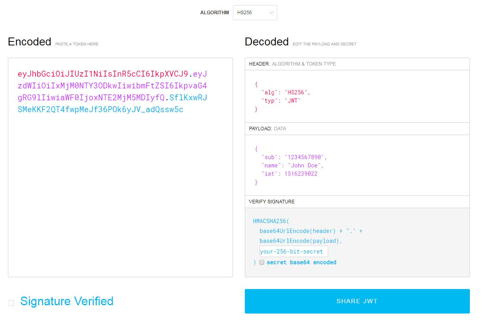
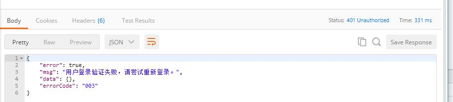
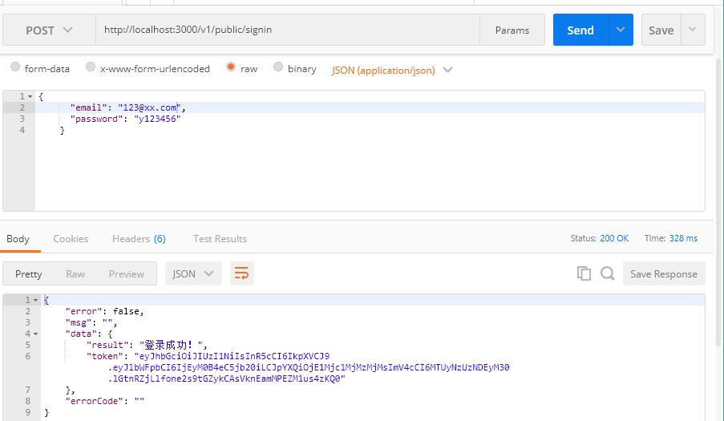

## JWT token验证

JWT（JSON Web Tokens） 是一个方便的一种实现服务器与客服端安全通讯的一种规范，是目前最流行的跨域认证解决方案。

### JWT 原理、结构、和使用

#### JWT 原理

在使用JWT做用户验证之前，先来看看如何使用session和cookie做用户验证，流程一般如下：

1. 服务器验证客户端发送的用户名和密码后，在当前对话（session）保存用户信息相关数据并返回一个 session_id给用户，写入用户 Cookie。
2. 之后用户的每次请求都会通过 Cookie 将 session_id 传回服务器，服务器收到 session_id，找到之前保存的数据并获得用户信息

如果像上面这种方式，session 数据共享不方便，不好实现跨域服务，如果是服务器集群，需要实现session共享才能让每台服务器都能够进行用户验证。

使用JWT，服务器认证用户之后，会生成一个JSON对象发回给用户，如：

```json
{
  "name": "Yuu",
  "role": "admin"
}
```

然后客户端请求服务的时候，都要发回上面的JSON对象以提供给服务端做验证。服务器还会为这个JSON添加签名以防止用户篡改数据。通过使用JWT，服务端不再保存session数据，更加容易实现扩展。

#### JWT 结构

JWT是一行使用 “.” 分割成三个部分的字符串，这被分隔的三个部分分别是：Header（头部）、Payload（负载）、Signature（签名），访问 https://jwt.io/  ，可以通过修改算法查看签名的计算公式以及结算结果，我们可以看到JWT的主要结构：



在上图可以看到JWT的三个部分分别显示为不同的颜色，我们分别对这三个部分进行分析：

第一部分（header）实际上是一个JSON对象，是描述JWT的元数据，其中 `alg` 表示的是签名的算法，默认HS256，`typ` 表示token的类型是JWT，如下：

```json
{
  "alg": "HS256",
  "typ": "JWT"
}
```

第二部分（Payload）就是上面简介中提到的JSON数据，是我们希望通过服务器发送给客户端的用户信息，我们可以在这个JSON里面定义需要发送的字段：

```json
{
  "sub": "1234567890",
  "name": "John Doe",
  "iat": 1516239022
}
```

当然，JWT官方提供了7个字段以供选用：

- iss (issuer)：签发人
- exp (expiration time)：过期时间
- sub (subject)：主题
- aud (audience)：受众
- nbf (Not Before)：生效时间
- iat (Issued At)：签发时间
- jti (JWT ID)：编号

第三部分（Signature）用来对上面两部分的数据进行签名，从而防止数据篡改，这个Signature需要制定一个密钥（secret），然后通过header里面制定的算法来产生签名。产生签名的算法也可以在上图看到，算法如下：

```js
HMACSHA256(
  base64UrlEncode(header) + "." +
  base64UrlEncode(payload),
  your-256-bit-secret
)
```

最终通过把上面三个部分组合成 Header.Payload.Signature 的形式返回给用户。

#### JWT 使用

客户端收到服务器返回的JWT，可以储存在Cookie或者localStorage里，在之后的请求需要上这个JWT，通过以下方式携带JWT：

- 通过Cookie自动发送，但是这样不能跨域。
- 放在HTTP请求的头信息Authorization字段里面：`Authorization: Bearer <token>`。
- 将JWT就放在POST请求的数据体里面。

*关于JWT的的介绍可以参考阮一峰的 [JSON Web Token 入门教程](http://www.ruanyifeng.com/blog/2018/07/json_web_token-tutorial.html)。*

### koa-jwt安装和使用

 我们使用[koa-jwt](https://github.com/koajs/jwt)中间件来验证客户端请求是否使用了有效的token，并且保护的路由，执行下面命令安装koa-jwt：

```shell
npm install koa-jwt
```

在前面的介绍中我们知道JWT分为三个部分，在签名部分我们需要使用一个密钥，因此在“.env”中添加jwt的密钥字符串，记得同时配置“.env.example”，如下：

```json
DB_PASSWORD=123456
JWT_SECRET=healthy-diet
```

然后在config里面添加JWT_SECRET配置，这个在[第五章](./document/chapter-5/chapter-5.md)已经介绍过，示例如下：

config\custom-environment-variables.json

```json
{
  "Database": {
    "password": "DB_PASSWORD"
  },
  "Token": {
    "jwtSecret": "JWT_SECRET"
  }
}
```

**注意：下面的设置保留了数据库密码和jwtSecret方便查看本项目，实际上需要移除**

```js
{
  "App": {
    "apiVersion": "/v1",
    "server": "0.0.0.0",
    "port": 3000
  },
  "Database": {
    "user": "Yuu",
    "password": "123456",
    "host": "127.0.0.1",
    "dbName": "healthyDiet",
    "port": 3001
  },
  "Token": {
    "jwtSecret": "healthy-diet"
  }
}

```


我们接下来就对需要保护的路由使用koa-jwt中间件，如下：

routes/index.js：

```js
// 省略
const response = require('../utils/response');
const jwt = require('koa-jwt');
const config = require('config');
const jwtSecret = config.get('Token.jwtSecret');

// 省略
// 处理token验证出错，返回401
router.use( (ctx, next) => {
  return next().catch((err) => {
    if (401 == err.status) {
      ctx.status = 401;
      ctx.body = response({
        errorCode: '003'
      })
    } else {
      throw err;
    }
  });
});

// 只有token验证通过了之后才执行这一行以后的中间件
router.use(jwt({ secret: jwtSecret }));

for (item in routeConfig) {
  router.use(routeConfig[item].path, routeConfig[item].route.routes(), routeConfig[item].route.allowedMethods());
}

module.exports = router;
```

上面的代码示例中，我们先为路由使用了一个中间件，这个中间件会判断 `ctx` 的 `status`，目的是为了处理token验证失败的响应，接着使用jwt中间件。启动服务之后，我们继续来访问注册接口，会得到以下提示：



表示我们的注册接口已经过koa-jwt验证，并且通过处理返回给客户端。

### 增加不受保护的公用路由

上面的实战将所有的路由都添加了jwt验证，但是我们希望部分接口不受限制（比如登录和注册），我们单独配置一个公用的路由，在“routes”目录下新增一个public.js，我们将用户注册的路由移到这里，如下：

routes/public.js

```js
const router = require('koa-router')();
const {user} = require('../controllers');

// 新增一个post路由，用来接收post请求
router.post('/register', async (ctx, next) => {
  // the parsed body will store in ctx.request.body
  // if nothing was parsed, body will be an empty object {}

  // 接收客户端请求传递的数据
  let reqBody = ctx.request.body;
  console.log(ctx.request.body);
  ctx.body = await user.register(reqBody);
});

module.exports = router;

```

然后在“routes/index.js”引入刚才新建的public路由，并且对路由进行设置，添加到中间件，代码如下：

```js
const publicRouter = require('./public');
// 省略
const routeConfig = [
  {
    path: '/users',
    route: users
  }, {
    path: '/material',
    route: material
  }
]
const publicRouteConfig = [
  {
    path: '/public',
    route: publicRouter
  }
]
// 省略

for (let item in publicRouteConfig) {
  router.use(publicRouteConfig[item].path, publicRouteConfig[item].route.routes(), publicRouteConfig[item].route.allowedMethods());
}
// 只有token验证通过了之后才执行这一行以后的中间件
router.use(jwt({ secret: jwtSecret }));

for (let item in routeConfig) {
  router.use(routeConfig[item].path, routeConfig[item].route.routes(), routeConfig[item].route.allowedMethods());
}

module.exports = router;

```

启动服务，我们把前端的注册接口改为调用 http://localhost:3000/v1/public/register ，请求有响应，证明路由设置成功。

### 生成token——用户登录接口

既然token验证已经加入项目中，我们在调用接口时就需要验证用户登录的token信息，下面来添加用户登录接口，当用户登录之后，服务器验证完用户信息，生成token返回给前端。首先，我们安装[jsonwebtoken](https://www.npmjs.com/package/jsonwebtoken)来实现jwt签名：

```shell
npm install jsonwebtoken
```

接着为user的model增加一个查询单个用户的方法，我们使用 `findOne` ,代码示例如下：

models/user.js

```js
// 省略
// 查询单个用户
  findOne(dataArr) {
    return new Promise((resolve, reject) => {
      this.users.findOne(dataArr, (err, docs) => { // 查询
        if (err) {
          console.log(err);
          reject(err);
        } else {
          resolve(docs);
        }
      })
    })
  }
// 省略
```

修改了model之后，需要在在controllers中添加对应的注册逻辑，先来看代码：

controllers\user.js

```js
// 省略
const jwt = require('jsonwebtoken');
const config = require('config');
const jwtSecret = config.get('Token.jwtSecret');

class UserController {
  constructor() {}
  // 省略

  // 登录
  async signin(reqBody) {
    let dataArr = {
      ...reqBody
    }
    try {
      let result = await user.findOne(dataArr); // 查询该用户
      let respon = {};

      let userToken = {
        email: result.email
      }
      const token = jwt.sign(userToken, jwtSecret, {expiresIn: '3h'}) //token签名 有效期为3小时
      const res = {
        result: '登录成功！',
        token: token
      }
      respon = response({data: res});

      return respon;
    } catch (err) {
      console.log(err)
      throw new Error(err);
      return err;
    }
  }
}

const userController = new UserController();

module.exports = userController;

```

上面的代码中，我们将登录获取到的用户信息添加到 `userToken` 对象，这个对象其实就是jwt的第二部分（Payload），并且还用之前定义好的密钥 `jwtSecret` 进行签名，使用 `{expiresIn: '3h'}` 设置了token的过期时间，最后将生成的token经过响应处理之后返回出来。接下来就是要在上面提到的“routes/public.js”中添加登录接口，如下：

```js
// 用户登录接口
router.post('/signin', async (ctx, next) => {
  let reqBody = ctx.request.body;
  ctx.body = await user.signin(reqBody);
});
```
启动服务，我们调用登录接口，这是就能看到返回的数据里面生成了token。


