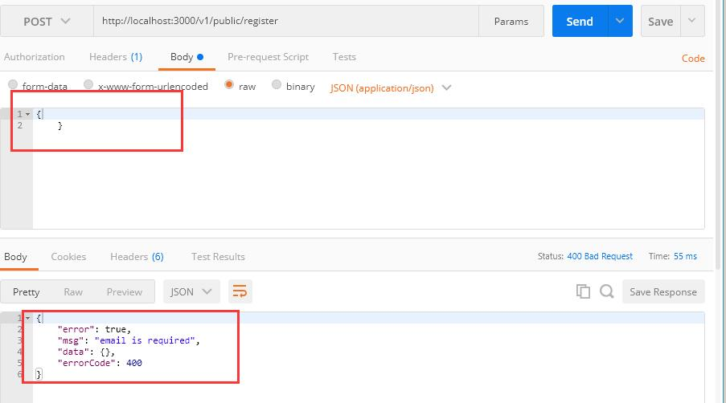

## 数据验证

在上面的实战中，我们已经完成了登录接口和注册接口，我们已经发现，如果调用登录接口或者注册接口时，不传参数或者传递错误的数据，我们的请求将不会成功，在 postman 中我们也可以看到显示 Not Found 。 这时我们需要为接口增加验证，虽然我们可以通过接受请求的body来对需要的参数进行判断，但是会显得非常繁杂，为了更加简便的对传参进行校验，我们使用 [koa2-validation](https://github.com/gedennis/koa2-validation) 来校验参数。

koa2-validation 是一个使用 Joi来校验请求的 koa 中间件。 支持 `body`, `params`, `query` 参数。

### 使用 koa2-validation

```shell
npm i koa2-validation
```

引入 koa2-validation，以用户注册登录为例，在 routes/public.js 中，

```js
const validate = require('koa2-validation'); // 引入 koa2-validation
const Joi = require('joi'); // 引入 joi
// 省略

// 定义用于验证的 schema
const register = {
  body: {
    email: Joi.string().required(),
    name: Joi.string().required(),
    password: Joi.number().required()
  }
};

const signin = {
  body: {
    email: Joi.string().required(),
    password: Joi.number().required()
  }
}

// 新增一个post路由，用来接收post请求
router.post('/register', validate(register), async (ctx, next) => { // 设置需要验证的中间件
  // 接收客户端请求传递的数据
  let reqBody = ctx.request.body;
  console.log(ctx.request.body);
  ctx.body = await user.register(reqBody);
});

// 用户登录接口
router.post('/signin', validate(signin), async (ctx, next) => {
  let reqBody = ctx.request.body;
  ctx.body = await user.signin(reqBody);
});

module.exports = router;

```

为了获取验证信息，我们将改造路由入口的错误处理中间件，routes/index.js

```js
// 省略

// 处理token验证出错，返回401,处理其它错误
router.use( (ctx, next) => {
  return next().catch((err) => {
    if (401 == err.status) {
      ctx.status = 401;
      ctx.body = response({
        errorCode: '003'
      })
    } else {
      ctx.status = err.status || err.code;
      ctx.body = response({
        errorCode: ctx.status,
        msg: err.message
      });
      throw err;
    }
  });
});

// 省略

module.exports = router;

```

接下来我们启动服务，用postman来请求参数，验证是否生效。



### 关于joi

https://github.com/hapijs/joi


> 待整理

Object schema description language and validator for JavaScript objects.

#### Introduction

Imagine you run facebook and you want visitors to sign up on the website with real names and not something like `l337_p@nda` in the first name field. How would you define the limitations of what can be inputted and validate it against the set rules?

This is joi, joi allows you to create *blueprints* or *schemas* for JavaScript objects (an object that stores information) to ensure *validation* of key information.

#### API

See the detailed [API Reference](https://github.com/hapijs/joi/blob/v13.3.0/API.md).

#### Example

```
const Joi = require('joi');

const schema = Joi.object().keys({
    username: Joi.string().alphanum().min(3).max(30).required(),
    password: Joi.string().regex(/^[a-zA-Z0-9]{3,30}$/),
    access_token: [Joi.string(), Joi.number()],
    birthyear: Joi.number().integer().min(1900).max(2013),
    email: Joi.string().email()
}).with('username', 'birthyear').without('password', 'access_token');

// Return result.
const result = Joi.validate({ username: 'abc', birthyear: 1994 }, schema);
// result.error === null -> valid

// You can also pass a callback which will be called synchronously with the validation result.
Joi.validate({ username: 'abc', birthyear: 1994 }, schema, function (err, value) { });  // err === null -> valid
```

The above schema defines the following constraints:

- ```
  username
  ```

  - a required string
  - must contain only alphanumeric characters
  - at least 3 characters long but no more than 30
  - must be accompanied by `birthyear`

- ```
  password
  ```

  - an optional string
  - must satisfy the custom regex
  - cannot appear together with `access_token`

- ```
  access_token
  ```

  - an optional, unconstrained string or number

- ```
  birthyear
  ```

  - an integer between 1900 and 2013

- ```
  email
  ```

  - a valid email address string

#### Usage

Usage is a two steps process. First, a schema is constructed using the provided types and constraints:

```
const schema = {
    a: Joi.string()
};
```

Note that **joi** schema objects are immutable which means every additional rule added (e.g. `.min(5)`) will return a new schema object.

Then the value is validated against the schema:

```
const {error, value} = Joi.validate({ a: 'a string' }, schema);

// or

Joi.validate({ a: 'a string' }, schema, function (err, value) { });
```

If the input is valid, then the error will be `null`, otherwise it will be an Error object.

The schema can be a plain JavaScript object where every key is assigned a **joi** type, or it can be a **joi** type directly:

```
const schema = Joi.string().min(10);
```

If the schema is a **joi** type, the `schema.validate(value, callback)` can be called directly on the type. When passing a non-type schema object, the module converts it internally to an object() type equivalent to:

```
const schema = Joi.object().keys({
    a: Joi.string()
});
```

When validating a schema:

- Values (or keys in case of objects) are optional by default.

  ```
  Joi.validate(undefined, Joi.string()); // validates fine
  ```

  To disallow this behavior, you can either set the schema as `required()`, or set `presence` to `"required"` when passing `options`:

  ```
  Joi.validate(undefined, Joi.string().required());
  // or
  Joi.validate(undefined, Joi.string(), /* options */ { presence: "required" });
  ```

- Strings are utf-8 encoded by default.

- Rules are defined in an additive fashion and evaluated in order after whitelist and blacklist checks.
