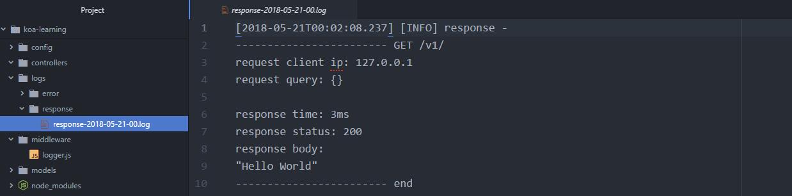

## Logs 日志

> 待补充

我们使用 [log4js-node](https://github.com/log4js-node/log4js-node) 。

### 安装

```shell
npm install log4js
```

### 日志设置和格式化

新增一个 logs 目录用来存放日志，然后在 config 目录新增一个 logConfig.js

config/logConfig.js

```js
const CONFIG = {
  "appenders": {
    error: {
      "category": "errorLogger", //logger名称
      "type": "dateFile", //日志类型
      "filename": 'logs/error/error', //日志输出位置
      "alwaysIncludePattern": true, //是否总是有后缀名
      "pattern": "-yyyy-MM-dd-hh.log" //后缀，每小时创建一个新的日志文件
    },
    response: {
      "category": "resLogger",
      "type": "dateFile",
      "filename": 'logs/response/response',
      "alwaysIncludePattern": true,
      "pattern": "-yyyy-MM-dd-hh.log"
    }
  },
  "categories": {
    error: {
      appenders: ['error'],
      level: 'error'
    },
    response: {
      appenders: ['response'],
      level: 'info'
    },
    default: {
      appenders: ['response'],
      level: 'info'
    }
  }
}

module.exports = CONFIG;

```

新建一个 utils 目录并添加一个 log.js

utils/log.js

```js
let log4js = require('log4js');

let logConfig = require('../config/logConfig');

//加载配置文件
log4js.configure(logConfig);

let log = {};

let errorLogger = log4js.getLogger('error'); //categories的元素
let resLogger = log4js.getLogger('response');

//封装错误日志
log.error = (ctx, error, resTime) => {
  if (ctx && error) {
    errorLogger.error(formatError(ctx, error, resTime));
  }
};

//封装响应日志
log.response = (ctx, resTime) => {
  if (ctx) {
    resLogger.info(formatRes(ctx, resTime));
  }
};

//格式化响应日志
let formatRes = (ctx, resTime) => {
  let responserLog = formatReqLog(ctx.request, resTime); // 添加请求日志
  responserLog.push(`response status: ${ctx.status}`); // 响应状态码
  responserLog.push(`response body: \n${JSON.stringify(ctx.body)}`); // 响应内容
  responserLog.push(`------------------------ end`); // 响应日志结束
  return responserLog.join("\n");
}

//格式化错误日志
let formatError = (ctx, err, resTime) => {
  let errorLog = formatReqLog(ctx.request, resTime); // 添加请求日志
  errorLog.push(`err name: ${err.name}`); // 错误名称
  errorLog.push(`err message: ${err.message}`); // 错误信息
  errorLog.push(`err stack: ${err.stack}`); // 错误详情
  errorLog.push(`------------------------ end`); // 错误信息结束
  return errorLog.join("\n");
};

// 格式化请求日志
let formatReqLog = (req, resTime) => {
  let method = req.method;
  // 访问方法 请求原始地址 客户端ip
  let formatLog = [`\n------------------------ ${method} ${req.originalUrl}`, `request client ip: ${req.ip}`];
  let startTime; // 开始时间

  if (method === 'GET') { // 请求参数
    formatLog.push(`request query: ${JSON.stringify(req.query)}\n`)
  } else {
    formatLog.push(`request body: ${JSON.stringify(req.body)}\n`)
  }

  // startTime = req.body.requestStartTime;
  formatLog.push(`response time: ${resTime}`) // 服务器响应时间
  return formatLog;
}

module.exports = log;
```

### 添加log中间件

新建一个目录 middleware ，并且新建一个文件 logger.js

middleware/logger.js

```js
const log = require('../utils/log');

const logger = () => {
  return async (ctx, next) => {
    const start = new Date(); //开始时间
    let ms; //间隔时间

    try {
      await next(); // 下一个中间件
      ms = new Date() - start;
      log.response(ctx, `${ms}ms`); //记录响应日志
    } catch (error) {
      ms = new Date() - start;
      log.error(ctx, error, `${ms}ms`); //记录异常日志
    }
  }
}
module.exports = logger;

```


在 app.js 引入刚刚添加的 log 处理逻辑。

app.js

```js
const Koa = require('koa');
const app = new Koa();
……
const logger = require('./middleware/logger'); // 引入logger

……
app.use(logger()); // 处理log的中间件
app.use(routes.routes()).use(routes.allowedMethods());
```

都设置好了之后，执行 `npm start` ，当启动成功之后，我们看到 log 目录里面多了两个文件，分别是报错日志和响应日志。在浏览器中访问 http://localhost:3000/v1 。可以看到响应日志里面添加了刚刚的访问记录。


