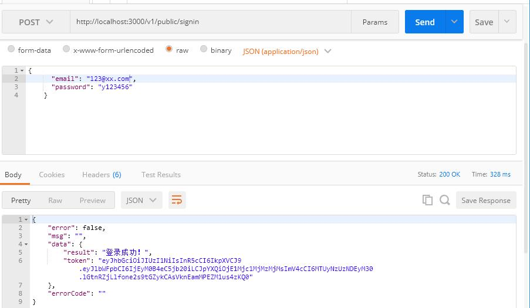

## JWT-token验证

JWT（JSON Web Tokens） 是一个方便的一种实现服务器与客服端安全通讯的一种规范。

### JWT

> 补充

### 安装和使用

 为了能够对用户登录进行验证，我们使用 JWT 来做校验，首先需要安装 [koa-jwt](https://github.com/koajs/jwt) 中间件。

```shell
npm install koa-jwt
```

在 .env 中添加 jwt 的加密混淆字符串，记得同时配置 .env.example ：

```json
DB_PASSWORD=123456
JWT_SECRET=healthy-diet
```

在config添加 JWT_SECRET  配置


config\custom-environment-variables.json

```json
{
  "Database": {
    "password": "DB_PASSWORD"
  },
  "Token": {
    "jwtSecret": "JWT_SECRET"
  }
}
```

注意：下面的设置保留了数据库密码和jwtSecret方便查看本项目，实际上需要移除

```js
{
  "App": {
    "apiVersion": "/v1",
    "server": "0.0.0.0",
    "port": 3000
  },
  "Database": {
    "user": "Yuu",
    "password": "123456",
    "host": "127.0.0.1",
    "dbName": "healthyDiet",
    "port": 3001
  },
  "Token": {
    "jwtSecret": "healthy-diet"
  }
}

```


我们接下来就在路由开始的地方使用 jwt 中间件。

routes/index.js：

```js
……
const response = require('../utils/response');
const jwt = require('koa-jwt');
const config = require('config');
const jwtSecret = config.get('Token.jwtSecret');

……
// 处理token验证出错，返回401
router.use( (ctx, next) => {
  return next().catch((err) => {
    if (401 == err.status) {
      ctx.status = 401;
      ctx.body = response({
        errorCode: '003'
      })
    } else {
      throw err;
    }
  });
});

// 只有token验证通过了之后才执行这一行以后的中间件
router.use(jwt({ secret: jwtSecret }));

for (item in routeConfig) {
  router.use(routeConfig[item].path, routeConfig[item].route.routes(), routeConfig[item].route.allowedMethods());
}

module.exports = router;
```

> 代码描述

启动服务之后，我们继续来访问注册接口，会得到以下提示：


表示我们的注册接口已经收到了 jwt 的验证。

### 公用路由

为了使注册接口不需要 token 验证，我们单独配置一个公用的路由，在 routes 目录下新增一个public.js，

将用户注册的路由移到这里。

routes/public.js

```js
const router = require('koa-router')();
const {user} = require('../controllers');

// 新增一个post路由，用来接收post请求
router.post('/register', async (ctx, next) => {
  // the parsed body will store in ctx.request.body
  // if nothing was parsed, body will be an empty object {}

  // 接收客户端请求传递的数据
  let reqBody = ctx.request.body;
  console.log(ctx.request.body);
  ctx.body = await user.register(reqBody);
});

module.exports = router;

```

然后在 routes 目录的 index.js 引入刚才新建的 public 路由，并且对路由进行设置，添加到中间件。

```js
const publicRouter = require('./public');
// 省略
const routeConfig = [
  {
    path: '/users',
    route: users
  }, {
    path: '/material',
    route: material
  }
]
const publicRouteConfig = [
  {
    path: '/public',
    route: publicRouter
  }
]
// 省略

for (let item in publicRouteConfig) {
  router.use(publicRouteConfig[item].path, publicRouteConfig[item].route.routes(), publicRouteConfig[item].route.allowedMethods());
}
// 只有token验证通过了之后才执行这一行以后的中间件
router.use(jwt({ secret: jwtSecret }));

for (let item in routeConfig) {
  router.use(routeConfig[item].path, routeConfig[item].route.routes(), routeConfig[item].route.allowedMethods());
}

module.exports = router;

```

启动服务，我们把前端的注册接口改为调用 http://localhost:3000/v1/public/register ，请求有响应，证明路由设置成功。

### 用户登录接口

既然 token 验证已经加入项目中，我们在调用接口时就需要验证用户登录的 token 信息，下面来添加用户登录接口，当用户登录之后，后台记录 token 信息，并且返回给前端 token。

首先，我们安装 jsonwebtoken 来实现 jwt：

```shell
npm install jsonwebtoken
```

接着为 user 的 model 增加一个查询单个用户的方法。

models/user.js

```js
……
// 查询单个用户
  findOne(dataArr) {
    return new Promise((resolve, reject) => {
      this.users.findOne(dataArr, (err, docs) => { // 查询
        if (err) {
          console.log(err);
          reject(err);
        } else {
          resolve(docs);
        }
      })
    })
  }
……
```

修改了 model 之后，我们在 controllers 中添加对应的注册逻辑

controllers\user.js

```js
……
const jwt = require('jsonwebtoken');
const config = require('config');
const jwtSecret = config.get('Token.jwtSecret');

class UserController {
  constructor() {}
  ……

  // 注册
  async signin(reqBody) {
    let dataArr = {
      ...reqBody
    }
    try {
      let result = await user.findOne(dataArr); // 查询该用户
      let respon = {};

      let userToken = {
        email: result.email
      }
      const token = jwt.sign(userToken, jwtSecret, {expiresIn: '3h'}) //token签名 有效期为3小时
      const res = {
        result: '登录成功！',
        token: token
      }
      respon = response({data: res});

      return respon;
    } catch (err) {
      console.log(err)
      throw new Error(err);
      return err;
    }
  }
}

const userController = new UserController();

module.exports = userController;

```

然后在上面提到的 routes/public.js 中添加登录接口。

```js
// 用户登录接口
router.post('/signin', async (ctx, next) => {
  let reqBody = ctx.request.body;
  ctx.body = await user.signin(reqBody);
});
```

启动服务，我们调用登录接口，这是就能看到返回的数据里面生成了token。


