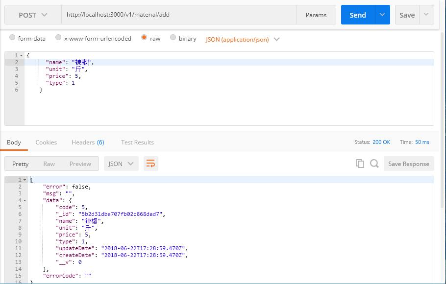

## 数据操作

### 新增和查询

在前面的介绍中，我们已经通过koa2-validation验证请求参数，现在讲开始进行数据插入和查询。下面的介绍将以 material 为例，我们将在 material 集合里面插入文档，并且通过请求查询文档。

为了实现新增和查询，我们先来改造 material model，和之前的user创建一样，我们增加查询和单个查询：

models/material.js

```js
const mongoose = require('mongoose');
const Schema = mongoose.Schema;

let materialModel = mongoose.model('Material', new Schema({
  code: String, // 食材编号
  name: String, // 名称
  unit: String, // 单位
  price: Number, // 单价
  type: Number, // 类型
  createDate: Date // 创建时间
}));

class Material {
  constructor() {
    this.material = materialModel;
    this.create = this.create.bind(this);
    this.find = this.find.bind(this);
    this.findOne = this.findOne.bind(this);
  }
  create(dataArr) {
    return new Promise((resolve, reject) => {
      let material = new this.material(dataArr);
      material.save((err, data) => {

        if (err) {
          console.log(err)
          reject(err);
          return
        }
        console.log('添加成功');
        resolve(data)
      });
    })
  }

  // 查询材料
  find(dataArr = {}) {
    return new Promise((resolve, reject) => {

      this.material.find(dataArr, (err, docs) => {
        if (err) {
          console.log(err);
          reject(err);
        } else {
          resolve(docs);
        }
      })
    })
  }

  // 查询一种材料
  findOne(reqParams) {
    return new Promise((resolve, reject) => {
      this.material.findOne(reqParams, (err, docs) => { // 查询
        if (err) {
          console.log(err);
          reject(err);
        } else {
          resolve(docs);
        }
      })
    })
  }
}

const material = new Material()

module.exports = material;

```

同样的，为了操作新增和查询，我们也需要一个controller，所以我们在 controllers 目录新建  material.js：

controllers/material.js

```js
let {material} = require('../models');
const response = require('../utils/response');

class MaterialController {
  constructor() {}
  // 接收请求传过来的body
  async addMaterial(reqBody) {
    let dataArr = { // 添加创建时间
      ...reqBody,
      createDate: new Date()
    }
    try {
      console.log("添加材料");
      let list = await material.find({name: dataArr.name});   // 先通过材料名验证材料是否存在
      let respon = {};
      if (list && list.length > 0) {
        respon = response({errorCode: '010'}); // 已经存在的材料提示错误
      } else {
        let newMaterial = await material.create(dataArr);
        respon = response({data: newMaterial});
      }
      return respon;
    } catch (err) {
      console.log(err)
      throw new Error(err);
      return err;
    }
  }

  // 获取材料
  async getMaterial(reqParams) {
    try {
      let respon = {};
      let result = await material.findOne(reqParams);
      respon = response({data: result});
      return respon;
    } catch (err) {
      console.log(err)
      throw new Error(err);
      return err;
    }

  }
}

const materialController = new MaterialController();

module.exports = materialController;

```

当然也不要忘记引入新增的controller，在 controllers/index.js 中引入：

```js
const user = require('./user');
const material = require('./material');

module.exports = {
  user, material
};
```

最后就是要在路由配置请求了，在 routes/material.js 中，我们将对添加材料和查询材料的接口进行定义，我们用GET请求来查询材料信息，并且对请求的参数 params 进行了校验：

```js
const validate = require('koa2-validation');
const Joi = require('joi');
const {material} = require('../controllers');
const router = require('koa-router')();

const addMaterial = {
  body: {
    code: Joi.string().required(), // 食材编号
    name: Joi.string().required(), // 名称
    unit: Joi.string(), // 单位
    price: Joi.number(), // 单价
    type: Joi.number(), // 类型
    createDate: Joi.date() // 创建时间
  }
}

const getMaterial = {
  params: { // 需要注意这里的校验改为了 params
    code: Joi.string().required(),
  }
}

router.post('/add', validate(addMaterial), async (ctx, next) => {
  let reqBody = ctx.request.body;
  ctx.body = await material.addMaterial(reqBody);
});

router.get('/:code', validate(getMaterial), async (ctx, next) => {
  let reqParams = ctx.params;
  ctx.body = await material.getMaterial(reqParams);
});

module.exports = router;

```

重新启动服务，在postman里面进行验证，这里提一下，由于我们的接口都需要token验证，因此需要先调用登录接口获得token，在postman中添加headers  `Authorization : Bearer token信息`  ，先来新增一个材料试试：

首先是设置headers验证


然后传入参数点击发送：


我们可以尝试重复发送请求，看是否会提示添加的材料重复，同样的，我们来看看查询是否有结果：


至此，我们已经能够通过请求来做新增和查询了。

### 使用继承

通过上面的实战，我们发现，在新增用户查询用户，新增材料查询材料的时候，我们都会去新增model来做查询和创建数据，细心观察我们发现这些model做的工作实际是一样的，无非就是增删查改，为了减少重复，我们决定把model单独抽取出来作为一个类，然后通过继承这个类来实现增删查改。

二话不说，先在models目录新建一个model.js，把对数据做的操作写进来，根据前面的介绍，我们只做了查询和新增，下面先写到 model.js ，在接下来的实战中，我们还会增加更多的处理：

models/model.js

```js
const mongoose = require('mongoose');
// 新增一个Model class
class Model {
  constructor(name, schema) {
    // 保存之前更新时间戳
    schema.pre('save', function(next) {
      if (this.isNew) {
        this.createDate = this.updateDate = Date.now()
      }
      else {
        this.updateDate = Date.now()
      }
      next()
    })
    // 创建model
    this.model = mongoose.model(name, schema);
    this.find = this.find.bind(this); // 绑定上下文
    this.create = this.create.bind(this);
    this.findOne = this.findOne.bind(this);
  }

  // 查询
  find(dataArr = {}) {
    return new Promise((resolve, reject) => {
      // 上面绑定了上下文，这里使用this.model
      this.model.find(dataArr, (err, docs) => {
        if (err) {
          console.log(err);
          reject(err);
        } else {
          resolve(docs);
        }
      })
    })
  }

  // 查询单个
  findOne(dataArr) {
    return new Promise((resolve, reject) => {
      this.model.findOne(dataArr, (err, docs) => {
        if (err) {
          console.log(err);
          reject(err);
        } else {
          resolve(docs);
        }
      })
    })
  }

  // 创建
  create(dataArr) {
    return new Promise((resolve, reject) => {
      let model = new this.model(dataArr);
      model.save((err, data) => {
        if (err) {
          console.log(err)
          reject(err);
          return
        }
        console.log('创建成功');
        resolve(data)
      });
    })
  }
}

module.exports = Model;

```

接下来的事情就变得更简单了，我们来改造原来的models/material.js 和 models/user.js ：

models/material.js

```js
const mongoose = require('mongoose');
const Schema = mongoose.Schema;
const Model = require('./model');

const materialSchema = new Schema({
  code: Number, // 食材编号
  name: String, // 名称
  unit: String, // 单位
  price: Number, // 单价
  type: Number, // 类型
  createDate: Date, // 创建时间
  updateDate: Date // 修改时间
});

class Material extends Model {
  constructor() {
    super('Material', materialSchema); // 调用父级class的构造函数，并且把自己的schema传递过去
  }
}

const material = new Material();

module.exports = material;

```

models/user.js

```js
const mongoose = require('mongoose');
const Schema = mongoose.Schema;
const Model = require('./model');

// 创建一个User schema，包含用户新增的字段定义
let userSchema = new Schema({
  userNo: String,
  email: String,
  password: String,
  name: String,
  sex: Number,
  userType: String,
  avatar: String,
  createDate: Date,
  updateDate: Date
});

class User extends Model {
  constructor() {
    super('User', userSchema);
  }
}
const user = new User();

module.exports = user;

```

重新启动服务，我们就可以再次调用接口验证了。

### 自增代码

关于前面写好的材料新增接口，由于前端调用时需要传递code，code表示材料的代码，并且接口只判断了材料名是否重复，并没有判断code，因此，我们打算做一个自增的code，由后台管理，并且前端并不需要传递code。

MongoDB默认使用12-byte ObjectId  的 _id 字段来作为文档的唯一标识，然而有时候我们需要修改这个字段，或者修改别的字段，使它的值能够自增，因此我们需要新增一个MongoDB文档推荐的 counters 集合，以本实战为例，我们接下来为 material 新增的文档的code字段做自增。

首先，这个集合包含两个字段 `_id` 和 `sequenceValue` , sequenceValue 就是用来记录最新的数值，而 _id 将用来标识当前的值是属于哪一种类型的自增。

我们在 models 目录新建一个 counters.js，然后创建需要的 model ，在这个 model 中，我们定义了能够用来自增的方法 `findByIdAndUpdate` 并且对 sequenceValue 的值进行了加1，需要注意的是，如果一开始没有这个文档，我们需要 `{ new: true,  upsert: true}` 选项来创建默认的文档。

models/counters.js

```js
const mongoose = require('mongoose');
const Schema = mongoose.Schema;
const Model = require('./model');

let countersSchema = new Schema({
  "_id": {
    type: String,
    required: true
  },
  "sequenceValue": {
    type: Number,
    default: 1
  }
});

class Counters extends Model {
  constructor() {
    super('Counters', countersSchema);
    this.findByIdAndUpdate = this.findByIdAndUpdate.bind(this);
  }

  findByIdAndUpdate(id) {

    return new Promise((resolve, reject) => {
      // 如果有计数，则对序列值进行自增,如果没有则创建
      this.model.findByIdAndUpdate({
        _id: id
      }, {
        $inc: {
          sequenceValue: 1
        }
      }, {
        new: true,
        upsert: true
      }, (err, docs) => {
        if (err) {
          reject(err);
        } else {
          resolve(docs);
        }
      })
    })
  }
}

const counters = new Counters();

module.exports = counters;
```

准备好 counters 之后，我们就需要对之前的 models/material.js 进行修改，首先我们把材料的code设置为 Number 类型并且默认值为1，然后使用mongoose的pre钩子在储存之前对model进行操作。我们可以通过下面的代码看到，在更新counters成功之后，我们会设置 material 的 code ，并且调用了钩子的 next 进入下一个处理。

```js
const mongoose = require('mongoose');
const Schema = mongoose.Schema;
const Model = require('./model');
const Counters = require('./Counters');

const materialSchema = new Schema({
  code: {
    type: Number,
    default: 1
  }, // 食材编号

	// 省略
})

class Material extends Model {
  constructor() {
    materialSchema.pre('save', async function(next) {
      try {
        if(this.code == 1) { // 对于已有ID的数据不做自增
          let counter = await Counters.findByIdAndUpdate('materialId');
          this.code = counter.sequenceValue;
          next()
        }
      } catch (err) {
        console.log(err);
        return next(err);
      }
    });
    super('Material', materialSchema); // 调用父级class的构造，并且把自己的model传递过去
  }
}


// 省略

```

然后剩的就是处理controllers和 router了，我们在 controllers/material.js 里把添加材料接收参数去掉日期的创建，并且在 routes/material.js 里面去掉code必填的校验。

 controllers/material.js

```js

// 省略

class MaterialController {
  constructor() {}
  // 接收请求传过来的body
  async addMaterial(reqBody) {
    let dataArr = {
      ...reqBody
    }
// 省略

```

 routes/material.js

```js
// 省略
const addMaterial = {
  body: {
    // code: Joi.string().required(), // 把这里的校验去掉
    name: Joi.string().required(),
    unit: Joi.string(),
    price: Joi.number(),
    type: Joi.number(),
    // createDate: Joi.date() // 由于创建时间和更新时间已经放到pre钩子里面处理，这里取消调用时的传递，我们同时也可以移除其它model以及controller里面对创建时间的定义和设置。
  }
}
// 省略
```

然后我们启动服务，就可以调用接口进行测试了，新增材料可以不传递code，完全有后台自动增加code的值。



### 分页查询

前面已经完成了材料添加的接口，接下来将为材料列表的查询增加分页。首先还是为model增加查询列表的方法。

models/model.js

```js
  constructor(name, schema) {
    // 省略
    this.pageSize = 10; // 在这里增加了默认一页查询10条

    // 省略
  }

  // 查询
  find(dataArr = {}) {
    let pageSize,
      page;
    if (dataArr.pageSize || dataArr.page) { // 如果在查询过程中传递了分页pageSize或者前页page
      pageSize = dataArr.pageSize || this.pageSize; // 使用分页
      page = dataArr.page || 1;
      dataArr.pageSize = undefined;
      dataArr.page = undefined;
      return new Promise((resolve, reject) => {
        this.model.find(dataArr).limit(pageSize).skip(pageSize * (page - 1)).sort({createDate: -1}).lean().exec((err, docs) => {
          if (err) {
            console.log(err);
            reject(err);
          } else {
            resolve(docs);
          }
        });
      })
    }
    // 如果没有传递分页，保留旧的查询
    return new Promise((resolve, reject) => {
      // 上面绑定了上下文，这里使用this.model
      this.model.find(dataArr, (err, docs) => {
        if (err) {
          console.log(err);
          reject(err);
        } else {
          resolve(docs);
        }
      })
    })
  }
  // 省略
```

controllers/material.js增加了新的查询方法

```js
class MaterialController {
  //省略


    // 查询材料
    async findMaterial(reqParams) {
      try {
        let respon = {};
        let result = await material.find(reqParams);
        respon = response({data: result});
        return respon;
      } catch (err) {
        console.log(err)
        throw new Error(err);
        return err;
      }

    }
}
```

接下来就是配置一个查询接口了：

routes/material.js

```js
//省略

const findMaterial = {
  query: {
    page: Joi.number(), // 页码
    pageSize: Joi.number(), // 页数
    name: Joi.string() // 关键词
  }
}

router.get('/', validate(findMaterial), async (ctx, next) => {
  let reqParams = ctx.query;
  ctx.body = await material.findMaterial(reqParams);
});

//省略

module.exports = router;

```

可以启动服务调用接口查看结果了。


### 修改和删除


### 文档的关联

https://stackoverflow.com/questions/21142524/mongodb-mongoose-how-to-find-subdocument-in-found-document

MongoDB, Mongoose: How to find subdocument in found document

I'm stuck on trying to get subdocument by `_id` in found document.

Example Schema

```
var User = mongoose.Schema({
        name:       String,
        photos:    [{src: String, title: String}]
    });
var Team = db.model('Team', Team);
```

Now I'm getting one user:

```
myUser = User.findOne(...)...
```

How can I get now `src` of his photo by it's `_id` (or `title`)?

Something like:

```
myUser.photos.findOne({'_id': myId})
```

You need to either create a NEW Schema for your embedded documents, or leave the type declaration as a blank array so `mongoose` interprets as a `Mixed` type.

```
var userSchema = new mongoose.Schema({
  name: String,
  photos: []
});
var User = mongoose.model('User', userSchema);
```

### -- OR --

```
var userSchema = new mongoose.Schema({
  name: String,
  photos: [photoSchema]
});

var photoSchema = new mongoose.Schema({
  src: String,
  title: String
});

var User = mongoose.model('User', userSchema);
```

And then you can save thusly:

```
var user = new User({
  name: 'Bob',
  photos: [ { src: '/path/to/photo.png' }, { src: '/path/to/other/photo.png' } ]
});

user.save();
```

From here, you can simply use array primitives to find your embedded docs:

```
User.findOne({name: 'Bob'}, function (err, user) {

  var photo = user.photos.filter(function (photo) {
    return photo.title === 'My awesome photo';
  }).pop();

  console.log(photo); //logs { src: '/path/to/photo.png', title: 'My awesome photo' }
});
```

### -- OR --

You can use the special `id()` method in embedded docs to look up by id:

```
User.findOne({name: 'Bob'}, function (err, user) {
    user.photos.id(photo._id);
});
```

You can read more here: <http://mongoosejs.com/docs/subdocs.html>

Make sure you **DON'T** register the schema with mongoose, otherwise it will create a new collection. Also keep in mind that if the child documents are searched for often, it would be a good idea to use refs and population like below. Even though it hits the DB twice, its much faster because of indexing. Also, `mongoose` will bonk on double nesting docs (i.e. The children have children docs as well)

```
var user = mongoose.Schema({
  name: String,
  photos: [{ type: Schema.Types.ObjectId, ref: 'Photo' }]
});

var photo = mongoose.Schema({
  src: String,
  title: String
});

User
  .findOne({ name: 'foo' })
  .populate('photos')
  .exec(function (err, user) {
    console.log(user.photos[0].src);
  });
```

Relevant docs can be found here <http://mongoosejs.com/docs/populate.html>


### http://mongoosejs.com/docs/populate.html

## Populate

MongoDB has the join-like [$lookup](https://docs.mongodb.com/manual/reference/operator/aggregation/lookup/) aggregation operator in versions >= 3.2. Mongoose has a more powerful alternative called `populate()`, which lets you reference documents in other collections.

Population is the process of automatically replacing the specified paths in the document with document(s) from other collection(s). We may populate a single document, multiple documents, plain object, multiple plain objects, or all objects returned from a query. Let's look at some examples.

```
var mongoose = require('mongoose');
var Schema = mongoose.Schema;

var personSchema = Schema({
  _id: Schema.Types.ObjectId,
  name: String,
  age: Number,
  stories: [{ type: Schema.Types.ObjectId, ref: 'Story' }]
});

var storySchema = Schema({
  author: { type: Schema.Types.ObjectId, ref: 'Person' },
  title: String,
  fans: [{ type: Schema.Types.ObjectId, ref: 'Person' }]
});

var Story = mongoose.model('Story', storySchema);
var Person = mongoose.model('Person', personSchema);
```

So far we've created two [Models](http://mongoosejs.com/docs/models.html). Our `Person` model has its `stories` field set to an array of `ObjectId`s. The `ref`option is what tells Mongoose which model to use during population, in our case the `Story` model. All `_id`s we store here must be document `_id`s from the `Story` model.

**Note**: `ObjectId`, `Number`, `String`, and `Buffer` are valid for use as refs. However, you should use `ObjectId` unless you are an advanced user and have a good reason for doing so.

### [Saving refs](http://mongoosejs.com/docs/populate.html#saving-refs)

Saving refs to other documents works the same way you normally save properties, just assign the `_id` value:

```
var author = new Person({
  _id: new mongoose.Types.ObjectId(),
  name: 'Ian Fleming',
  age: 50
});

author.save(function (err) {
  if (err) return handleError(err);

  var story1 = new Story({
    title: 'Casino Royale',
    author: author._id    // assign the _id from the person
  });

  story1.save(function (err) {
    if (err) return handleError(err);
    // thats it!
  });
});
```

### [Population](http://mongoosejs.com/docs/populate.html#population)

So far we haven't done anything much different. We've merely created a `Person` and a `Story`. Now let's take a look at populating our story's `author` using the query builder:

```
Story.
  findOne({ title: 'Casino Royale' }).
  populate('author').
  exec(function (err, story) {
    if (err) return handleError(err);
    console.log('The author is %s', story.author.name);
    // prints "The author is Ian Fleming"
  });
```

Populated paths are no longer set to their original `_id` , their value is replaced with the mongoose document returned from the database by performing a separate query before returning the results.

Arrays of refs work the same way. Just call the [populate](http://mongoosejs.com/docs/api.html#query_Query-populate) method on the query and an array of documents will be returned *in place* of the original `_id`s.

### [Setting Populated Fields](http://mongoosejs.com/docs/populate.html#setting-populated-fields)

In Mongoose >= 4.0, you can manually populate a field as well.

```
Story.findOne({ title: 'Casino Royale' }, function(error, story) {
  if (error) {
    return handleError(error);
  }
  story.author = author;
  console.log(story.author.name); // prints "Ian Fleming"
});
```

### [Field Selection](http://mongoosejs.com/docs/populate.html#field-selection)

What if we only want a few specific fields returned for the populated documents? This can be accomplished by passing the usual [field name syntax](http://mongoosejs.com/docs/api.html#query_Query-select) as the second argument to the populate method:

```
Story.
  findOne({ title: /casino royale/i }).
  populate('author', 'name'). // only return the Persons name
  exec(function (err, story) {
    if (err) return handleError(err);

    console.log('The author is %s', story.author.name);
    // prints "The author is Ian Fleming"

    console.log('The authors age is %s', story.author.age);
    // prints "The authors age is null'
  });
```

### [Populating Multiple Paths](http://mongoosejs.com/docs/populate.html#populating-multiple-paths)

What if we wanted to populate multiple paths at the same time?

```
Story.
  find(...).
  populate('fans').
  populate('author').
  exec();
```

If you call `populate()` multiple times with the same path, only the last one will take effect.

```
// The 2nd `populate()` call below overwrites the first because they
// both populate 'fans'.
Story.
  find().
  populate({ path: 'fans', select: 'name' }).
  populate({ path: 'fans', select: 'email' });
// The above is equivalent to:
Story.find().populate({ path: 'fans', select: 'email' });
```

### [Query conditions and other options](http://mongoosejs.com/docs/populate.html#query-conditions)

What if we wanted to populate our fans array based on their age, select just their names, and return at most, any 5 of them?

```
Story.
  find(...).
  populate({
    path: 'fans',
    match: { age: { $gte: 21 }},
    // Explicitly exclude `_id`, see http://bit.ly/2aEfTdB
    select: 'name -_id',
    options: { limit: 5 }
  }).
  exec();
```

### [Refs to children](http://mongoosejs.com/docs/populate.html#refs-to-children)

We may find however, if we use the `author` object, we are unable to get a list of the stories. This is because no `story` objects were ever 'pushed' onto `author.stories`.

There are two perspectives here. First, you may want the `author` know which stories are theirs. Usually, your schema should resolve one-to-many relationships by having a parent pointer in the 'many' side. But, if you have a good reason to want an array of child pointers, you can `push()` documents onto the array as shown below.

```
author.stories.push(story1);
author.save(callback);
```

This allows us to perform a `find` and `populate` combo:

```
Person.
  findOne({ name: 'Ian Fleming' }).
  populate('stories'). // only works if we pushed refs to children
  exec(function (err, person) {
    if (err) return handleError(err);
    console.log(person);
  });
```

It is debatable that we really want two sets of pointers as they may get out of sync. Instead we could skip populating and directly `find()` the stories we are interested in.

```
Story.
  find({ author: author._id }).
  exec(function (err, stories) {
    if (err) return handleError(err);
    console.log('The stories are an array: ', stories);
  });
```

The documents returned from [query population](http://mongoosejs.com/docs/api.html#query_Query-populate) become fully functional, `remove`able, `save`able documents unless the [lean](http://mongoosejs.com/docs/api.html#query_Query-lean) option is specified. Do not confuse them with [sub docs](http://mongoosejs.com/docs/subdocs.html). Take caution when calling its remove method because you'll be removing it from the database, not just the array.

### [Populating an existing document](http://mongoosejs.com/docs/populate.html#populate_an_existing_mongoose_document)

If we have an existing mongoose document and want to populate some of its paths, **mongoose >= 3.6** supports the [document#populate()](http://mongoosejs.com/docs/api.html#document_Document-populate) method.

### [Populating multiple existing documents](http://mongoosejs.com/docs/populate.html#populate_multiple_documents)

If we have one or many mongoose documents or even plain objects (_like [mapReduce](http://mongoosejs.com/docs/api.html#model_Model.mapReduce) output_), we may populate them using the [Model.populate()](http://mongoosejs.com/docs/api.html#model_Model.populate) method available in **mongoose >= 3.6**. This is what `document#populate()` and `query#populate()` use to populate documents.

### [Populating across multiple levels](http://mongoosejs.com/docs/populate.html#deep-populate)

Say you have a user schema which keeps track of the user's friends.

```
var userSchema = new Schema({
  name: String,
  friends: [{ type: ObjectId, ref: 'User' }]
});
```

Populate lets you get a list of a user's friends, but what if you also wanted a user's friends of friends? Specify the `populate` option to tell mongoose to populate the `friends` array of all the user's friends:

```
User.
  findOne({ name: 'Val' }).
  populate({
    path: 'friends',
    // Get friends of friends - populate the 'friends' array for every friend
    populate: { path: 'friends' }
  });
```

### [Populating across Databases](http://mongoosejs.com/docs/populate.html#cross-db-populate)

Let's say you have a schema representing events, and a schema representing conversations. Each event has a corresponding conversation thread.

```
var eventSchema = new Schema({
  name: String,
  // The id of the corresponding conversation
  // Notice there's no ref here!
  conversation: ObjectId
});
var conversationSchema = new Schema({
  numMessages: Number
});
```

Also, suppose that events and conversations are stored in separate MongoDB instances.

```
var db1 = mongoose.createConnection('localhost:27000/db1');
var db2 = mongoose.createConnection('localhost:27001/db2');

var Event = db1.model('Event', eventSchema);
var Conversation = db2.model('Conversation', conversationSchema);
```

In this situation, you will **not** be able to `populate()` normally. The `conversation` field will always be null, because `populate()` doesn't know which model to use. However, [you can specify the model explicitly](http://mongoosejs.com/docs/api.html#model_Model.populate).

```
Event.
  find().
  populate({ path: 'conversation', model: Conversation }).
  exec(function(error, docs) { /* ... */ });
```

This is known as a "cross-database populate," because it enables you to populate across MongoDB databases and even across MongoDB instances.

### [Dynamic References](http://mongoosejs.com/docs/populate.html#dynamic-ref)

Mongoose can also populate from multiple collections at the same time. Let's say you have a user schema that has an array of "connections" - a user can be connected to either other users or an organization.

```
var userSchema = new Schema({
  name: String,
  connections: [{
    kind: String,
    item: { type: ObjectId, refPath: 'connections.kind' }
  }]
});

var organizationSchema = new Schema({ name: String, kind: String });

var User = mongoose.model('User', userSchema);
var Organization = mongoose.model('Organization', organizationSchema);
```

The `refPath` property above means that mongoose will look at the `connections.kind` path to determine which model to use for `populate()`. In other words, the `refPath` property enables you to make the `ref` property dynamic.

```
// Say we have one organization:
// `{ _id: ObjectId('000000000000000000000001'), name: "Guns N' Roses", kind: 'Band' }`
// And two users:
// {
//   _id: ObjectId('000000000000000000000002')
//   name: 'Axl Rose',
//   connections: [
//     { kind: 'User', item: ObjectId('000000000000000000000003') },
//     { kind: 'Organization', item: ObjectId('000000000000000000000001') }
//   ]
// },
// {
//   _id: ObjectId('000000000000000000000003')
//   name: 'Slash',
//   connections: []
// }
User.
  findOne({ name: 'Axl Rose' }).
  populate('connections.item').
  exec(function(error, doc) {
    // doc.connections[0].item is a User doc
    // doc.connections[1].item is an Organization doc
  });
```

### [Populate Virtuals](http://mongoosejs.com/docs/populate.html#populate-virtuals)

*New in 4.5.0*

So far you've only populated based on the `_id` field. However, that's sometimes not the right choice. In particular, [arrays that grow without bound are a MongoDB anti-pattern](https://docs.mongodb.com/manual/tutorial/model-referenced-one-to-many-relationships-between-documents/). Using mongoose virtuals, you can define more sophisticated relationships between documents.

```
var PersonSchema = new Schema({
  name: String,
  band: String
});

var BandSchema = new Schema({
  name: String
});
BandSchema.virtual('members', {
  ref: 'Person', // The model to use
  localField: 'name', // Find people where `localField`
  foreignField: 'band', // is equal to `foreignField`
  // If `justOne` is true, 'members' will be a single doc as opposed to
  // an array. `justOne` is false by default.
  justOne: false
});

var Person = mongoose.model('Person', PersonSchema);
var Band = mongoose.model('Band', BandSchema);

/**
 * Suppose you have 2 bands: "Guns N' Roses" and "Motley Crue"
 * And 4 people: "Axl Rose" and "Slash" with "Guns N' Roses", and
 * "Vince Neil" and "Nikki Sixx" with "Motley Crue"
 */
Band.find({}).populate('members').exec(function(error, bands) {
  /* `bands.members` is now an array of instances of `Person` */
});
```

Keep in mind that virtuals are *not* included in `toJSON()` output by default. If you want populate virtuals to show up when using functions that rely on `JSON.stringify()`, like Express' [`res.json()` function](http://expressjs.com/en/4x/api.html#res.json), set the `virtuals: true` option on your schema's `toJSON` options.

```
// Set `virtuals: true` so `res.json()` works
var BandSchema = new Schema({
  name: String
}, { toJSON: { virtuals: true } });
```

If you're using populate projections, make sure `foreignField` is included in the projection.

```
Band.
  find({}).
  populate({ path: 'members', select: 'name' }).
  exec(function(error, bands) {
    // Won't work, foreign field `band` is not selected in the projection
  });

Band.
  find({}).
  populate({ path: 'members', select: 'name band' }).
  exec(function(error, bands) {
    // Works, foreign field `band` is selected
  });
```

### [Populate in Middleware](http://mongoosejs.com/docs/populate.html#populate-middleware)

You can populate in either pre or post [hooks](http://mongoosejs.com/docs/middleware.html). If you want to always populate a certain field, check out the [mongoose-autopopulate plugin](http://npmjs.com/package/mongoose-autopopulate).

```
// Always attach `populate()` to `find()` calls
MySchema.pre('find', function() {
  this.populate('user');
});
```

```
// Always `populate()` after `find()` calls. Useful if you want to selectively populate
// based on the docs found.
MySchema.post('find', async function(docs) {
  for (let doc of docs) {
    if (doc.isPublic) {
      await doc.populate('user').execPopulate();
    }
  }
});
```

```
// `populate()` after saving. Useful for sending populated data back to the client in an
// update API endpoint
MySchema.post('save', function(doc, next) {
  doc.populate('user').execPopulate(function() {
    next();
  });
});
```

### Next Up

Now that we've covered `populate()`, let's take a look at [discriminators](http://mongoosejs.com/docs/discriminators.html).


# [Why can't you modify the data returned by a Mongoose Query (ex: findById)](https://stackoverflow.com/questions/14504385/why-cant-you-modify-the-data-returned-by-a-mongoose-query-ex-findbyid)

When I try to change any part of the data returned by a Mongoose Query it has no effect.

I was trying to figure this out for about 2 hours yesterday, with all kinds of `_.clone()`s, using temporary storage variables, etc. Finally, just when I though I was going crazy, I found a solution. So I figured somebody in the future (fyuuuture!) might have the save issue.

```
Survey.findById(req.params.id, function(err, data){
    var len = data.survey_questions.length;
    var counter = 0;

    _.each(data.survey_questions, function(sq){
        Question.findById(sq.question, function(err, q){
            sq.question = q; //has no effect

            if(++counter == len) {
                res.send(data);
            }
        });
    });
});
```

For cases like this where you want a plain JS object instead of a full model instance, you can call [`lean()`](http://mongoosejs.com/docs/api.html#query_Query-lean) on the query chain like so:

```
Survey.findById(req.params.id).lean().exec(function(err, data){
    var len = data.survey_questions.length;
    var counter = 0;

    _.each(data.survey_questions, function(sq){
        Question.findById(sq.question, function(err, q){
            sq.question = q;

            if(++counter == len) {
                res.send(data);
            }
        });
    });
});
```

This way `data` is already a plain JS object you can manipulate as you need to.


### ES6中的CLASS继承

> 待补充

constructor

super

extends


## session和cookie

### HTTP 的几个特性

HTTP (HyperText   Teansfer Protocol 超文本传输协议)  

- HTTP遵循 client/server 模型，是一个客户端和服务器端请求和应答的标准
- HTTP是无状态的(stateless) 协议，每一次传输都是独立的，互不影响。
- HTTP是一个应用层 (application layer) 协议，他在传输层(transfer layer)协议之上，99%以上的HTTP协议使用 (TCP) 作为它的传输层协议。
- 客户端请求服务端使用client action即是method，包括get、post、delete等。
- HTTP定义了服务端状态码返回给客户端，200、404、500等。
- HTTP支持 headers，Cache-Control、Content-type 等。

### Session& Cookie简介

由于HTTP是无状态的，客户端请求服务之后，服务端是不能判断HTTP请求是由那个用户发起的、用户在网站的状态等。cookie和session使HTTP能够维持状态。

cookie是由浏览器保存的一段文本，包含用户在网站上的必要的信息，在发送HTTP请求的时候会把这些信息加载请求头中发送给服务端。

session是服务端存储的用来标识用户信息的数据，当用户访问网站时，服务端会为这个用户创建一个唯一的session id，服务器会把这个id通过cookie的形式传给浏览器，浏览器接收cookie之后，以后的请求就能携带这个cookie发送，通过这个session id 服务端就能够对访问的用户进行辨别。类似于商店发的会员卡(cookie)，它记录了用户的信息 identification，并且是由商店(服务端)发给用户(客户端)，每当用户去商店消费，用户携带着会员卡，商店管理了自己发布的卡，通过卡的ID(session id)找到对应该用户的信息。

cookie分类：

会话 cookie (Session cookie) 在会话结束时（浏览器关闭）会被删除。

持久化 cookie（Persistent cookie）在到达失效日期时会被删除。

### cookie使用

客户端使用

服务端使用

### session使用


## excel导出

>  待补充


### 浏览器不能下载response输出的excel

用ajax提交是不行的，因为ajax基于XMLHttpRequest ，XMLHttpRequest 的定义就是：可以同步或异步返回 Web 服务器的响应，并且能**以文本或者一个 DOM 文档**形式返回内容。而我们的Excel是二进制流。所以Excel会被强转成文本，就像乱码一样。（**效果类同你用记事本打开Excel文件**）

在浏览器直接访问下载的URL，如果能自动下载。ok，代码没问题。

### 前端请求方式

form提交

window.open/location.href等

a标签

iframe


## 文件上传

> 待整理
