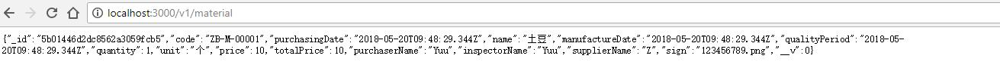

## mongoose-管理数据库

[mongoose文档](http://www.nodeclass.com/api/mongoose.html)

### 安装

```shell
npm install mongoose
```

### 连接MongoDB

首先在 ` config` 目录新增一个 `dbConfig.js` ：

`config\dbConfig.js`

```js
let mongoose = require('mongoose');
const config = require('config');
const dbConfig = config.get('Database');

exports.connect = (request, response) => {
  mongoose.connect(`mongodb://${dbConfig.user}:${dbConfig.password}@${dbConfig.host}:${dbConfig.port}/${dbConfig.dbName}?authSource=${dbConfig.dbName}`);
  let db = mongoose.connection;
  db.on('error', () => {
    console.log('Mongoose连接错误: ' + err);
  });
  db.once('open', callback => {
    console.log(`Mongoose连接到${dbConfig.dbName}`);
  });
}
```

然后在 /index.js 引入 config/dbConfig.js：

```js
const db = require('./config/dbConfig');
db.connect();
```

我们启动服务 `npm start` 即可看到数据库连接成功。

### model

在 mongoose 中，所有的东西都从 [Schema](http://www.nodeclass.com/api/mongoose.html#guide) 中衍生出来，先新建一个文件夹叫  models ，并在这个文件夹下新建一个 index.js ，再在该目录下新建 material.js

> 目的 描述

models/material.js

```js
const mongoose = require('mongoose');
const Schema = mongoose.Schema;

let materialModel = mongoose.model('Material', new Schema({
  code: String, // 食材编号
  purchasingDate: Date, // 采购日期
  name: String, // 名称
  manufactureDate: Date, //生成日期
  qualityPeriod: Date, // 保质期
  quantity: Number, // 数量
  unit: String, // 单位
  price: Number, // 单价
  totalPrice: Number, // 金额
  purchaserName: String, // 采购人
  inspectorName: String, // 收验货人
  supplierName: String, // 供货人
  sign: String, // 签字
}));

class Material {
  constructor() {
    this.material = materialModel;
    this.create = this.create.bind(this);
  }
  create(dataArr) {
    return new Promise((resolve, reject) => {
      let material = new this.material(dataArr);
      material.save((err, data) => {

        if (err) {
          console.log(err)
          reject(err);
          return
        }
        console.log('添加成功');
        resolve(data)
      });
    })
  }
}

const material = new Material()

module.exports = material;

```

以上的代码创建了一个叫 Material 的 model。

models/index.js

```js
const material = require('./material');

module.exports = {
  material
};
```

> 描述

新增数据：

routes/material.js

```js
const {material} = require('../models');
const router = require('koa-router')();

router.get('/', async (ctx, next) => {

  try {
    ctx.response.body = await material.create({
      code: 'ZB-M-00001', // 食材编号
      purchasingDate: new Date(), // 采购日期
      name: '土豆', // 名称
      manufactureDate: new Date(), //生成日期
      qualityPeriod: new Date(), // 保质期
      quantity: 1, // 数量
      unit: '个', // 单位
      price: 10, // 单价
      totalPrice: 10, // 金额
      purchaserName: 'Yuu', // 采购人
      inspectorName: 'Yuu', // 收验货人
      supplierName: 'Z', // 供货人
      sign: '123456789.png', // 签字
    });
  } catch (err) {
    console.log(err)
    throw new Error(err);
  }
});

module.exports = router;

```

我们修改 routes/index.js 的路由设置。

```js
……
const users = require('./users');
const material = require('./material');
const routeConfig = [
  {
    path: '/users',
    route: users
  }, {
    path: '/material',
    route: material
  }
]

……

router.use(logger);
router.get('/', index);

for (let item in routeConfig) {
  router.use(routeConfig[item].path, routeConfig[item].route.routes(), routeConfig[item].route.allowedMethods());
}

module.exports = router;
```

重启服务访问 http://localhost:3000/v1/material 即可看到新增的数据了，并且数据库添加了新的数据。




