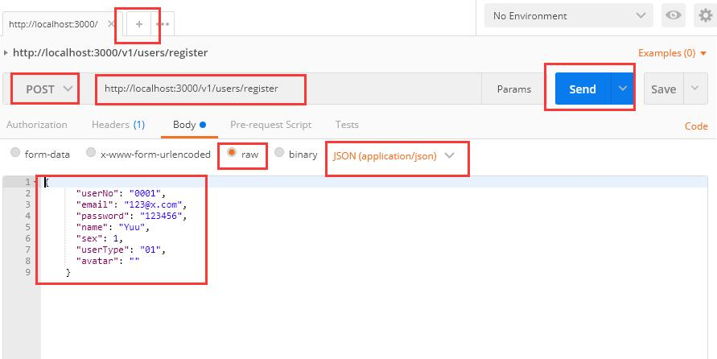
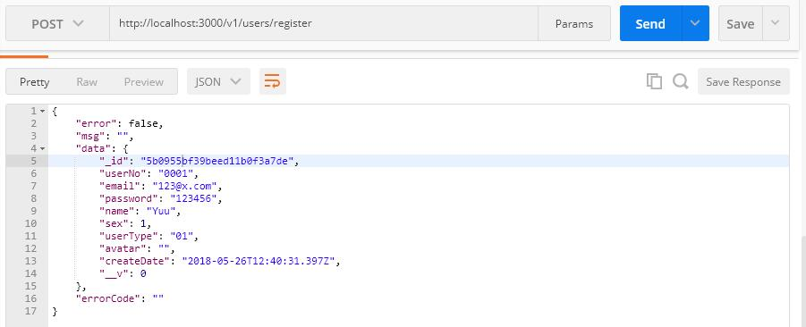

## RESTful API

### 响应

> 目的 描述

在 utils 目录新建 response.js ，在 config 目录新建 errorCode.json。

utils/response.js

```js
const errorCode = require('./errorCode');
// 对响应数据进行规范，如果传递的对象有errorCode，返回报错信息
module.exports = (response) => {
  const {errorCode, data, msg} = response;
  if (errorCode) {
    return {
      "error": true,
      "msg": msg
        ? msg
        : errorCode[response.errorCode],
      "data": {},
      "errorCode": errorCode
    }
  }
  if (data) {
    return {
      "error": false,
      "msg": msg
        ? msg
        : "",
      "data": data,
      "errorCode": ""
    }
  }
};

```

config/errorCode.json

```js
{
    "000":"系统错误，请联系管理员。",
    "001":"请先登录账户登录。",
    "002":"该邮箱已经注册过，请更换邮箱。",
    "003":"用户登录验证失败，请尝试重新登录。",
    // 省略
}
```

### 注册接口

为了实现用户注册，我们需要新增一个用户 model ，在 models 目录下新增一个 user.js ，并且在 model 的index.js 引入。

models/user.js

```js
const mongoose = require('mongoose');
const Schema = mongoose.Schema;

// 创建一个User model，包含用户新增的字段定义
let userModel = mongoose.model('User', new Schema({
  userNo: String,
  email: String,
  password: String,
  name: String,
  sex: Number,
  userType: String,
  avatar: String,
  createDate: Date
}));

// 新增一个用户class
class User {
  constructor() {
    this.users = userModel;
    this.find = this.find.bind(this); // 绑定上下文
    this.create = this.create.bind(this);
  }

  // 查询用户
  find(dataArr = {}) {
    return new Promise((resolve, reject) => {

      // 上面绑定了上下文，这里使用this.users
      this.users.find(dataArr, (err, docs) => { // 查询
        if (err) {
          console.log(err);
          reject(err);
        } else {
          resolve(docs);
        }
      })
    })
  }

  // 创建用户
  create(dataArr) {
    return new Promise((resolve, reject) => {
      let users = new this.users(dataArr);
      users.save((err, data) => {
        if (err) {
          console.log(err)
          reject(err);
          return
        }
        console.log('创建用户成功');
        resolve(data)
      });
    })
  }
}
const user = new User()

module.exports = user;

```

然后在models/index.js 引入user model

```js
const material = require('./material');
const user = require('./user');

module.exports = {
  material,
  user
};
```

为了便于逻辑控制，我们将注册用户的操作放到单独的文件中进行，新增目录 controllers ，并在其中新增 index.js 文件和 user.js 文件。

controllers/user.js

```js
……
const response = require('../utils/response');

class UserController {
  constructor() {}
  // 定义一个一部函数register用来注册用户，接收请求传过来的body
  async register(reqBody) {
    let dataArr = { // 展开运算，并添加创建时间
      ...reqBody,
      createDate: new Date()
    }
    try {
      let list = await user.find({email: dataArr.email}); // 先查询是否存在该用户
      let respon = {};
      if (list && list.length > 0) {
        respon = response({errorCode: '002'});
      } else {
        let newUser = await user.create(dataArr); // 如果没有注册过就进行注册
        respon = response({data: newUser});
      }
      return respon;
    } catch (err) {
      console.log(err)
      throw new Error(err);
      return err;
    }
  }
}

const userController = new UserController();

module.exports = userController;
```

我们也新建一个 controllers/index.js 来引入要用的 controller：

```js
const user = require('./user');

module.exports = {
  user
};

```

接下来需要在路由定义一个请求接口了，我们将之前的 routes\users.js 进行以下修改：

```js
const router = require('koa-router')();
const {user} = require('../controllers');

router.get('/', (ctx, next) => {
  ctx.response.body = 'users';
});

// 新增一个post路由，用来接收post请求
router.post('/register', async (ctx, next) => {
  // 接收客户端请求传递的数据
  let reqBody = ctx.request.body;
  console.log(ctx.request.body);
  ctx.body = await user.register(reqBody);
});

module.exports = router;

```

这样就定义了一个 RESTful API 了，为了验证能够调用成功，我们使用 postman 来进行调试。

### postman-调用接口

安装postman，打开并进行注册，这里不进行描述。打开postman，新增配置一个接口调用，如下图：



点击send，我们就可以发送一个post请求了，我们采用JSON格式传递数据。通过上面的操作我们看到 postman 里面产生响应数据，但是并没有我没新建的用户信息，我们再查看数据库集合里面多了一个文档，但是缺少了用户信息。


> 描述 补充

造成这个结果的原因是我们采用 JSON 类型来传递请求数据，context 里面获取的请求 body 为 undefined。为了让 koa 能够支持 JSON 类型的 body 数据，我们 [koa-bodyparser](https://github.com/koajs/bodyparser) 来处理,，koa-bodyparser 支持 `json`, `form` and `text` 类型的 body 。

安装：

```shell
npm install koa-bodyparser
```

在 app.js 使用这个中间件：

```js
const Koa = require('koa');
const app = new Koa();

……
const bodyParser = require('koa-bodyparser');


……
app.use(logger());
app.use(bodyParser());
app.use(routes.routes()).use(routes.allowedMethods());
……
```

重启服务之后，我们再次点击发送。



### 跨域访问

通过上面的实例，我们已经能够经过 postman 请求接口并存入数据了。为了验证接口是否能够在前端项目里面调用，我们将在前端页面中去请求这个接口。前端项目地址：待补充

在启动页面之后我们输入对应的数据，点击注册。我们发现浏览器的 console 里面报了一个错误。

Failed to load http://localhost:3000/v1/users/register: Response to preflight request doesn't pass access control check: No 'Access-Control-Allow-Origin' header is present on the requested resource. Origin 'http://localhost:8080' is therefore not allowed access.

这正是因为我们的接口没有允许跨域访问请求导致的。


> 描述 补充

为了解决这个问题，我们使用 [koa-cors](https://www.npmjs.com/package/koa-cors) 中间件来处理跨域请求。

```shell
npm install koa-cors
```

app.js

```js
……
const cors = require('koa-cors');

……
app.use(logger());
app.use(cors());
app.use(bodyParser());
……

```

重启服务之后我们再次点击注册。


成功，我们已经能在前端项目调用注册接口来注册用户了。
